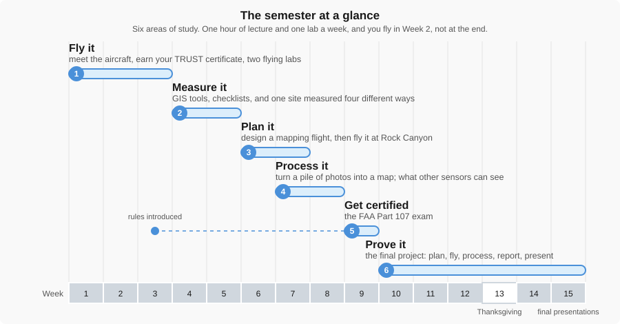
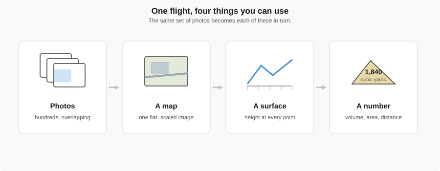

# Welcome to Drone Measurements

{ width="100%" }

You will fly a drone in the first lab of this class. By the end of the semester you will be able to
put one over a construction site, turn what it saw into a map, measure something off that map, and
defend the number when a client asks where it came from.

That last part is what makes this an engineering course rather than a flying course.

!!! abstract "Key Takeaways"
    - **A drone is a measuring instrument.** It happens to fly. What matters is the data it brings
      back.
    - **Accuracy is something you buy.** More of it costs more time, money, and effort. Deciding how
      much you actually need is part of the job.
    - **You have to be able to defend the number.** Anyone can produce a measurement. An engineer
      can explain why it is good enough for the decision being made.

---

## What you'll do this semester

{ width="100%" }

*Six areas of study across the semester. Each builds on the one before it.*

The course runs the whole semester. Each week is a short Tuesday lecture followed by something you
actually do on Thursday: a flight, a lab, or a piece of software. The navigation on the left follows
the semester week by week, and the areas above are the shape those weeks make. The [flight checklists](../class_resources/flight_check_list/index.md) and
[Flight Basics](flight_basics.md) are there whenever you need them.

---

## Before you fly: the TRUST certificate

You need a **TRUST** certificate before the first flying lab in Week 2, and you will not be allowed
to fly without it. It is free, online, takes about 30 minutes, and is designed so that everyone
passes. [The TRUST Certificate](trust_certificate.md) page says what it is, how to take it, and what
to do with the certificate when you finish.

---

## Why engineers care

Every project has a budget and a deadline. A measurement ten times more accurate than the decision
requires is wasted money. One that is not accurate enough is worse than useless, because it still
looks like an answer.

{ width="100%" }

*A drone sits between a tape measure and a survey crew: it covers a whole site quickly and gets
close to survey accuracy.*

Drones did not replace any of the older methods. They filled a gap nothing else covered well, which
is large areas, quickly, at an accuracy good enough for most civil work. That is why they turned up
on construction sites so fast.

---

## What you get from a flight

A drone flight produces photographs. Software turns those photographs into things you can measure.

{ width="100%" }

*The same set of photos becomes a map, then a surface, then a number you can put in a report.*

Each of those has a name, a file format, and a question it is good at answering.
[Aerial Measurement Products](data_products.md) is the reference page for all of them, and you will come
back to it through the rest of the course.

---

## Activity: the right tool for the job

An engineer's first measurement decision is not *how* to measure but *how accurately the answer has
to be*. Too little accuracy and the number cannot support the decision; too much and you have spent
time and money buying digits nobody will use.

For each scenario below, decide which method fits, then open the answer. The methods, roughly in
order of accuracy and cost:

- **Eyeball or pacing** — free, seconds, good to a few percent at best
- **Tape measure or hand tools** — cheap, minutes, good to a fraction of an inch over short distances
- **Google Maps / Google Earth** — free, minutes, good to a metre or two, and the imagery may be years old
- **Drone photos** — an hour, a picture of the whole site, no reliable measurements without more work
- **Drone map with ground control** — half a day, centimetre-level over a whole site
- **Survey crew** — total station or high-order GPS, days and dollars, millimetres

**1. Site reconnaissance.** A remote 100-acre field may have large boulders or trees on it. You need
to know before you send a crew and a trailer of equipment.

??? note "Answer"
    **Google Earth first, a drone flight if the imagery is old.** The question is yes or no, not a
    number. Any method that shows the field is accurate enough. Sending a survey crew to answer it
    would cost more than the trip you are trying to avoid.

**2. Structural monitoring.** You are checking whether a bridge support has settled by more than
5 millimetres in the last year.

??? note "Answer"
    **Survey crew, with precise levelling or a total station against fixed benchmarks.** Five
    millimetres is below what a drone map can resolve reliably, and the answer decides whether a
    bridge stays open. This is the case where buying the most accuracy available is the cheap
    option.

**3. Earthwork volume.** A contractor bills the owner every week for a 50-foot-tall stockpile of dirt
that changes size as trucks come and go.

??? note "Answer"
    **Drone map with ground control.** A few percent accuracy on a volume is fine for billing, a
    tape cannot measure a pile, and a survey crew every week costs more than the dirt. This is the
    gap drones filled on construction sites.

**4. New flooring.** You are ordering laminate for a bedroom at home.

??? note "Answer"
    **Tape measure.** An inch either way changes nothing, because you order ten percent extra for
    cuts anyway. Nothing here needs an aircraft, or even a second decimal place.

**5. Property line dispute.** A neighbour says your new fence is two feet onto their land.

??? note "Answer"
    **A licensed surveyor with a total station or survey-grade GPS.** Two feet is easy to measure;
    the hard part is measuring it *from the legal boundary*, which is defined by recorded monuments,
    not by anything you can see in Google Earth. Aerial imagery can be offset from the true position
    by a metre or more, which is the whole dispute. The consequence is legal, so the method has to be
    defensible in court.

**6. Parking count.** Is this gravel lot roughly big enough for forty cars?

??? note "Answer"
    **Pacing, or the measure tool in Google Maps.** You need the area to within five or ten
    percent, and forty cars at roughly 30 square metres each is a rough number to begin with. Spend
    two minutes, not two hours.

**7. Progress documentation.** A contractor has to show the owner what a 20-acre site looked like
every two weeks for the life of the project.

??? note "Answer"
    **Drone photos, or an orthomosaic without ground control.** The owner wants to *see* progress,
    not measure it. A map that is a metre off in absolute position is still a perfect record of
    what was built when. Adding ground control would double the effort for a number nobody asked
    for.

**8. Floor flatness.** A new concrete slab has to meet a flatness specification of an eighth of an
inch over ten feet before the flooring contractor will accept it.

??? note "Answer"
    **A ten-foot straightedge and feeler gauges, or a laser level.** This is a millimetre question
    over a short distance, exactly where hand tools win and a drone is useless. Matching the tool to
    the scale of the question matters as much as matching it to the accuracy.

**9. Roof damage.** After a hailstorm, an insurer needs to know how much of a warehouse roof is
damaged.

??? note "Answer"
    **Drone photos.** The measurement is "what fraction of the roof", which imagery answers to
    within a few percent, and the alternative is putting a person on a damaged roof. Sometimes the
    method is chosen for safety as much as for accuracy.

!!! tip "The pattern"
    Scenarios 2, 5 and 8 needed the most accuracy and got the most expensive or most specialised
    tool. Scenarios 1, 4 and 6 needed almost none and got the cheapest. The drone won the middle:
    large areas, moderate accuracy, repeated often. That middle is most of civil engineering, which
    is why this course exists. The measurement reading in Week 5 turns this instinct into a method.

---

## What you need

- **Your TRUST certificate**, before the first lab. See
  [The TRUST Certificate](trust_certificate.md). This one is not optional.
- **Nothing to buy.** Aircraft, controllers, and batteries are provided.
- **A laptop** that can run QGIS, which is free.
- **Closed-toe shoes and a jacket.** Some of this class happens outside.
- **No prior experience.** Most students arrive having never flown anything.

??? note "Course learning objectives"
    By the end of this course, students will be able to:

    - Apply drone-based measurement techniques to civil engineering problems
    - Evaluate the accuracy and limitations of different measurement methods
    - Integrate drone-derived data into engineering analysis and design workflows
    - Make informed, ethical, and defensible engineering decisions based on measured data

---

Next up: [Flight Basics](flight_basics.md), which covers the aircraft, the controller, and how to
get it into the air and back again.

---

## Where this is used

Your first time flying is [Week 2 lab — Intro to Flying](../labs/0_intro_to_flying.md).
