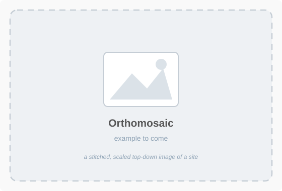
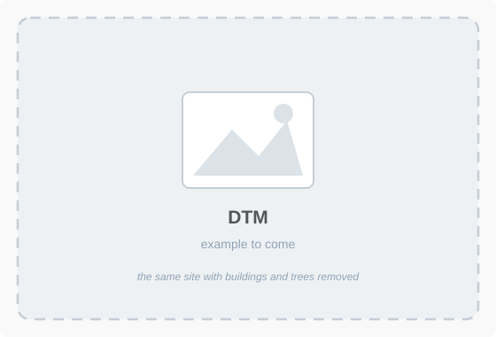
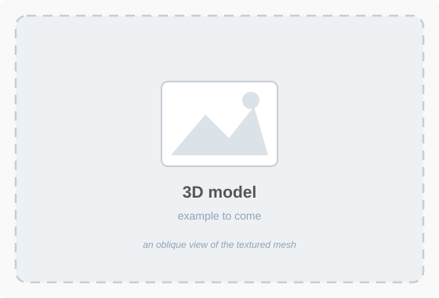
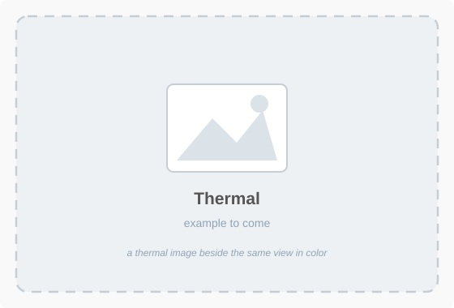
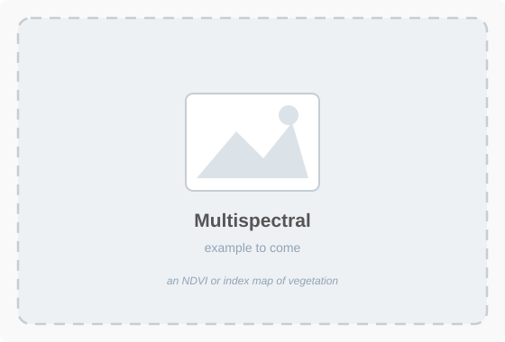

# Aerial Measurement Products

!!! abstract "Key Takeaways"
    - **Match the sensor to the question.** A normal camera cannot measure temperature, plant
      health, or gas. Specialized sensors exist because those need different physics, not because
      they are better cameras.
    - **The same product can come from different sensors.** A 3D model can be built from ordinary
      photographs or from LiDAR, and there are good reasons to choose either.
    - Each product answers a **different question**. Picking the wrong one is a common and
      expensive mistake.
    - **DSM keeps the trees and buildings. DTM removes them.** That single distinction decides
      whether your earthwork numbers are right.

This page is a reference. You will come back to it from Week 4 through Week 8 as each product turns up.

---

## What comes from what

{ width="100%" }

*Photographs are the only thing a drone actually collects. Every product below is derived from them,
and each step throws some information away in exchange for being easier to use.*

!!! tip "Where this is going"
    By the end of this page you should be able to answer a question like *"how much dirt is in that
    stockpile?"* with the name of a product. Eight such questions are waiting near the bottom, under
    [Which product answers which question](#which-product-answers-which-question). Try them before you
    open the answers.

---

## The products

| Product | What it is | What you measure with it | Usual file |
|---------|------------|--------------------------|------------|
| **Photos** | The original overlapping images, straight off the memory card | Nothing directly; they are the input to everything else | `.jpg`, `.dng` |
| **Orthomosaic** | Every photo stitched together and geometrically corrected into one flat, correctly scaled image | Distance, area, position, counting things | `.tif` (GeoTIFF) |
| **Point cloud** | Millions of individual 3D points, each with a position and a color | Shapes, cross sections, clearances | `.las`, `.laz` |
| **DSM** (Digital Surface Model) | The height of the top of everything: ground, trees, roofs, equipment | Building and canopy heights, clearances, stockpile volumes | `.tif` |
| **DTM** (Digital Terrain Model) | The height of the bare ground, with vegetation and structures stripped out | Earthwork volumes, grading, drainage and runoff | `.tif` |
| **3D model** | A solid mesh surface with the photographs draped over it as texture | Visual inspection, presentations, walkthroughs | `.obj`, `.fbx` |
| **Contours** | Lines of equal elevation traced from the DTM | Grading plans and construction drawings | `.shp`, `.dxf` |
| **Thermal mosaic** | The same kind of map, but showing temperature instead of color | Heat loss, trapped moisture, failing equipment | `.tif` |
| **Index map** | A ratio between light bands, such as NDVI | Plant health and stress, bare ground, erosion | `.tif` |

!!! note "DEM, DSM, or DTM?"
    **DEM**, Digital Elevation Model, is the umbrella term, and people use it loosely for either of
    the other two. When it matters, say **DSM** for the surface with everything on it and **DTM**
    for bare ground. If someone hands you a "DEM" for an earthwork calculation, ask which one they
    mean before you use it.

---

## Matching the sensor to the need

Choosing a sensor is the same kind of decision as choosing a measurement method: pay for capability
only when the question needs it.

| Sensor | Measures | Reach for it when |
|--------|----------|-------------------|
| **Standard camera** | Visible light | Almost always. It is already on the aircraft and answers most questions |
| **LiDAR** | Distance, by timing laser pulses | Ground under vegetation, power lines, or when you need geometry at night |
| **Thermal** | Surface temperature | Heat loss, trapped moisture, failing equipment, leak detection |
| **Multispectral** | Light bands beyond visible | Plant health and stress, erosion, bare ground |
| **Dedicated detectors** | One specific thing, such as methane or carbon monoxide | Leak surveys and safety work, where the answer is a concentration |

### Photographs or LiDAR for a 3D model?

Both produce a point cloud and a 3D model. Neither is simply better: the equipment costs more for
LiDAR while the time costs more for photographs, so the answer depends on the site and on which of
the two is short.

| | From photographs | From LiDAR |
|---|---|---|
| **Equipment cost** | Low. The camera is already there | High. A dedicated sensor and a heavier aircraft |
| **Time cost** | Hours of processing to solve the geometry | Much less. The points come out almost directly |
| **Needs** | Daylight and visible texture | Neither. It works at night and over plain surfaces |
| **Vegetation** | Sees the top of the canopy only | Pulses slip between leaves and reach the ground |
| **Result** | Full color, looks like the real thing | Precise geometry, limited or no color |
| **Best for** | Open sites, stockpiles, visual records | Forested ground, power lines, dense structure |

!!! tip "The usual answer is a camera"
    Reach past a standard camera when the question genuinely requires it, and be ready to say what
    the extra sensor bought you. "We flew LiDAR because the stockpile was under tree cover" is an
    engineering justification. "We flew LiDAR because we had it" is not.

---

## DSM or DTM

This is the distinction worth getting right, because both look plausible and only one of them gives
you the correct answer for earthwork.

{ width="100%" }

*Use a DSM when you care about what is standing on the ground. Use a DTM when you care about the
ground itself.*

---

## Which product answers which question

You have now seen every product on the list. For each question below, decide which product you would
reach for — and say why — before opening the answers. In class you will do this in groups.

1. How big is this parking lot?
2. How much dirt is in that stockpile?
3. Where will water collect after a storm?
4. Will the crane clear that roof?
5. What did this site look like last month?
6. Is heat escaping from that roof?
7. Which part of this slope is not growing back?
8. What do I show the client?

??? note "Answers"
    | Question | Reach for | Because |
    |---|---|---|
    | 1. Parking lot size | Orthomosaic | A flat, correctly scaled map; area is a 2D question |
    | 2. Stockpile volume | DSM or point cloud | You need the height of the pile, not the ground under it |
    | 3. Where water collects | DTM | Drainage follows the bare ground, not the tops of trees and trucks |
    | 4. Crane clearance | Point cloud or DSM | The obstacle is the roof itself, so surface height is the question |
    | 5. Last month's site | Orthomosaic from that date | Same product, earlier flight; the value is the date |
    | 6. Heat escaping | Thermal mosaic | Only the thermal sensor measures temperature |
    | 7. Slope not regrowing | Index map | Plant health is a band ratio, invisible in ordinary color |
    | 8. Show the client | 3D model or orthomosaic | Communication, not measurement; pick what reads fastest |

    Notice that the two hardest calls, 2 and 3, are exactly the DSM-versus-DTM distinction above.

---

## Examples

{ width="48%" } { width="48%" }

{ width="48%" } { width="48%" }

{ width="48%" } { width="48%" }

{ width="48%" } { width="48%" }

*Real examples from class flights will replace these placeholders.*

---

## What you'll produce in this class

| Topic | What you make |
|------|---------------|
| 2 | An orthomosaic, from photos flown for you |
| 3 | Measurements off that orthomosaic, compared against pacing and Google Maps |
| 4 | A flight plan designed to produce a good orthomosaic and surface model |
| 6 | Thermal and multispectral products, and LiDAR point clouds |

Next: [Flight Basics](flight_basics.md) covers the aircraft itself and how to get it into the air.

---

## Where this is used

- [Week 5 lab — Measurements and Methods](../labs/2_measurements_and_methods.md) — you measure off an orthomosaic
- [Week 8 lab — Data Processing](../labs/5_data_processing.md) — you produce these products from your own flight
