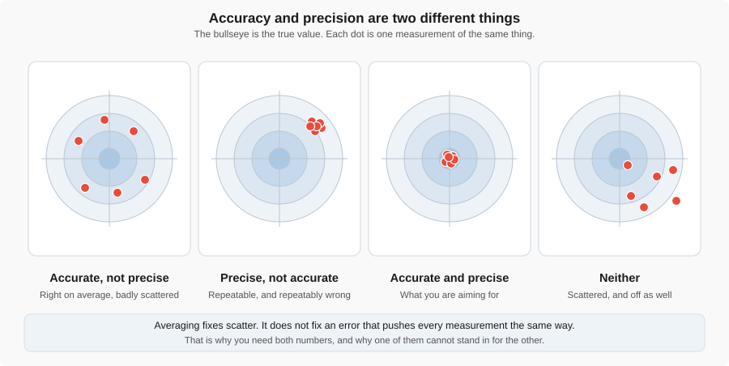
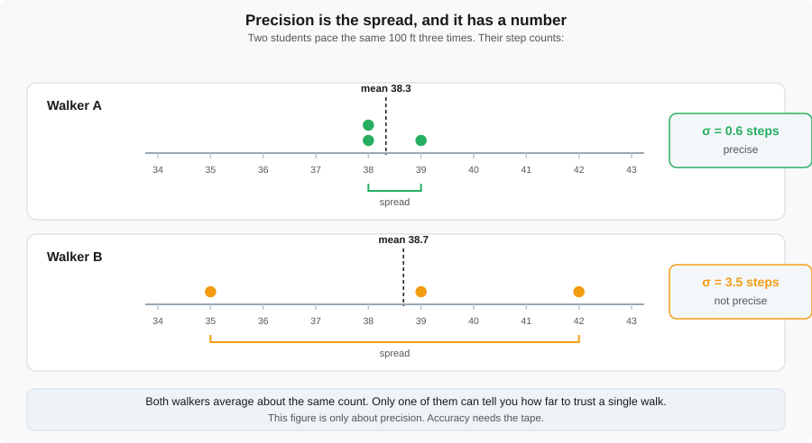
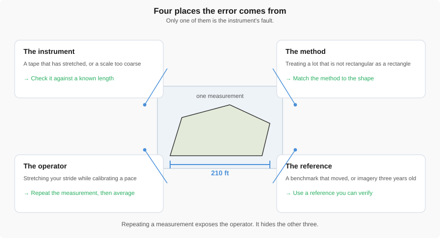
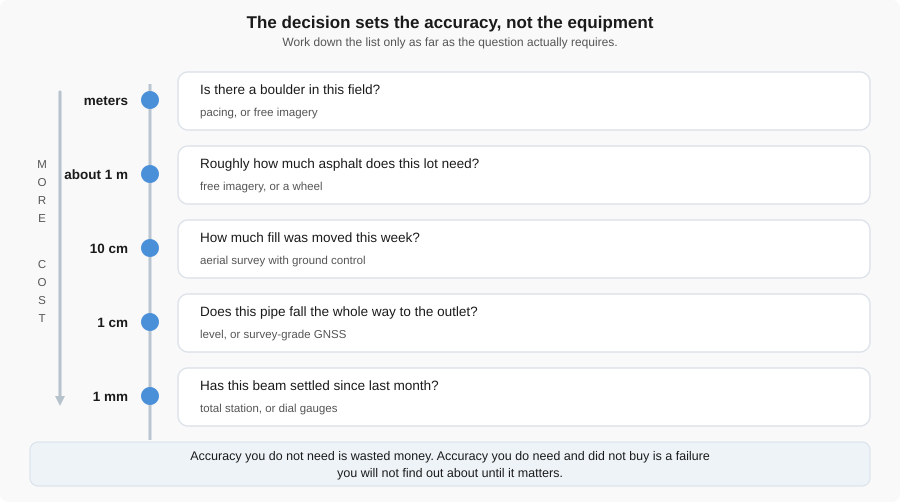
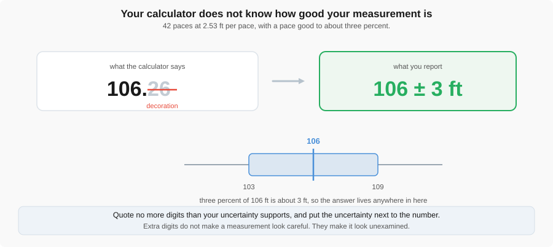
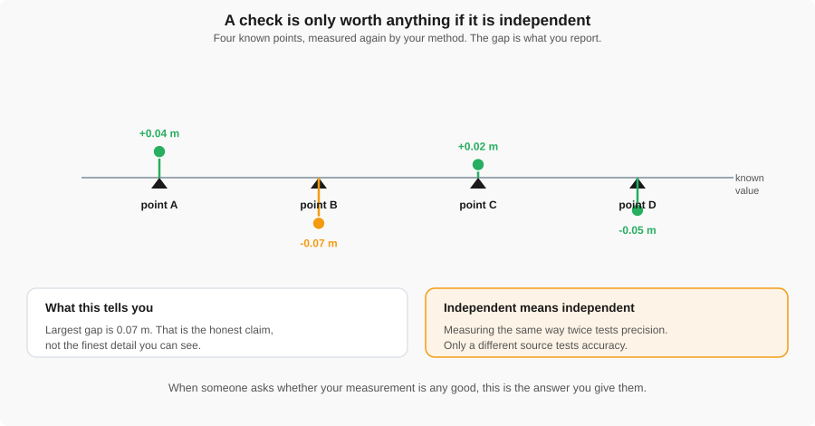

# Measurement Fundamentals

!!! abstract "Key Takeaways"
    - **A measurement with no range attached is a guess, not a measurement.** "210 feet" is an
      assertion; "210 ± 6 feet" is something an engineer can act on.
    - **Accuracy, precision, and resolution are three different things.** You can be precise and
      wrong, accurate on average but scattered, or fine-grained and badly off the truth.
    - **The decision sets the accuracy you need, not the other way around.** Buying more accuracy
      than a decision requires is waste; missing accuracy you needed is a failure you discover late.
    - **Pacing it off is sometimes the right answer.** Every method on the list, from a pair of boots
      to a survey crew, is correct for some question and wasteful for another.

Every method in this reading — pacing, a tape, web imagery, a survey crew, and more — answers the same
question: how good is this number, and is it good enough for the decision at hand?
[Week 5 lab — Measurements and Methods](../labs/2_measurements_and_methods.md) is where you test that against a real parking lot.

---

## 1. Every measurement is a number, a unit, and a range

"The lot is 210 feet long" sounds definite, but it is not a measurement an engineer can use — it does
not say how far wrong it might be. "210 ± 6 feet" is: the first is an assertion, the second is
something you can design or budget against. That range is what the rest of this reading is about:
where it comes from, how to estimate it honestly, and how to report it.

---

## 2. Accuracy, precision, and resolution

Three words get used interchangeably in casual speech and mean three different things in
engineering. Getting them confused is not just sloppy language — it leads to the wrong fix. If your
numbers are scattered, averaging more of them helps. If they are scattered around the wrong answer,
averaging more of them does nothing at all.

{ width="100%" }

*Figure 1: Accurate means close to the true value. Precise means the repeats agree with each other.
Averaging fixes scatter; it does not fix a shot that is consistently off to one side.*

- **Accuracy** — how close a measurement is to the true value. Errors that hurt accuracy are usually
  **systematic**: they push every measurement the same direction, so repeating the measurement does
  not reveal them.
- **Precision** — how closely repeated measurements of the same thing agree with each other. Errors
  that hurt precision are usually **random**: they scatter measurements around, so repeating and
  averaging reduces their effect.
- **Resolution** — the smallest difference an instrument can show you. A tape graduated in sixteenths
  of an inch, a bathroom scale that reads to the nearest pound, a site plan drawn at 1:100 — all are
  statements about the tool, not about whether the tool is telling the truth.

!!! note "These three do not move together"
    A tape that has stretched half a percent is still graduated in sixteenths of an inch, and reads
    to that resolution every time in exactly the same wrong way. Fine resolution, good precision,
    poor accuracy — that combination is exactly what a stretched tape gives you.

### How much do your repeats scatter?

Precision has a number attached to it: the **standard deviation**, written $\sigma$ (sigma). It is
the typical distance of a measurement from the average of its group. A small $\sigma$ means the
repeats agree closely; a large one means they do not. It comes straight off a calculator or a
spreadsheet:

$$
\sigma = \sqrt{\frac{\sum_{i=1}^{n}(x_i - \bar{x})^2}{n-1}}
$$

where $\bar{x}$ is the average of your $n$ repeats. Dividing by $n-1$ rather than $n$ is a standard
correction for working from a small sample, which is exactly what three pace counts are.

!!! example "Walker A's three counts"
    Walker A paces a 100-ft reference distance three times and counts 38, 39, and 38 steps.

    **Average:** $\bar{x} = \dfrac{38+39+38}{3} = 38.33$ steps

    **Deviations from the average:** $-0.33,\ +0.67,\ -0.33$

    **Squared deviations:** $0.11,\ 0.44,\ 0.11$, summing to $0.67$

    **Standard deviation:** $\sigma = \sqrt{\dfrac{0.67}{3-1}} = \sqrt{0.33} \approx 0.6$ steps

    A standard deviation of 0.6 steps on an average near 38 is tight agreement. Walker A is precise.

Walker B paces the same 100 ft three times and counts 35, 42, and 39 — an average of 38.7, almost the
same as Walker A, but a standard deviation of about 3.5 steps. Same average, very different spread.

{ width="100%" }

*Figure 2: Walker A (38, 39, 38) and Walker B (35, 42, 39) land on nearly the same average, but only
one of them is precise. This figure says nothing about which walker is accurate — for that you still
need the tape.*

!!! note "Precision is not accuracy, even here"
    Both walkers could still be wrong. If either one stretched their stride while calibrating, every
    step is long in the same way, and no amount of averaging will catch it. Precision tells you how
    far to trust a single walk against your own other walks; accuracy only comes from checking
    against something independent — the taped 100 ft itself.

---

## 3. Where the error comes from

Every measurement error traces back to one of four places.

{ width="100%" }

*Figure 3: Instrument, method, operator, and reference. Repeating a measurement mostly exposes the
operator; it does not reveal the other three.*

| Source | Example | What helps |
|---|---|---|
| The instrument | A tape that has stretched; a scale too coarse to show the difference you care about | A better instrument, or a calibrated one |
| The method | Treating an irregular lot as a rectangle | A method that matches the actual shape |
| The operator | Stretching your stride while calibrating; reading a tape at an angle | Practice, and repeated measurements |
| The reference | A benchmark that has shifted; imagery that is years out of date | A reference you can independently verify |

The method row matters more than it looks. The Week 5 lab has you treat a parking lot as a rectangle even
though it is not one — often the largest source of error in the whole exercise, and no instrument
caused it.

!!! note "Repeating a measurement does not catch everything"
    Pacing the same distance three times tells you only about the operator. It says nothing about a
    stretched reference tape or a method that does not match the shape you are measuring — precision
    tests just one of the four boxes above.

---

## 4. Uncertainty: the number you actually report

**Uncertainty** is what you hand to somebody else. It is the range that accounts for the instrument,
the method, the operator, and the reference all at once, boiled down to a single ± figure attached
to your answer.

!!! example "Carrying pace uncertainty through to a distance"
    A calibrated pace is typically good to a few percent — call it about 3%. That is Section 2's
    standard deviation turned into a percentage: Walker A's 0.6 steps on a count of about 38 is
    roughly 1.5%, and a working figure of 3% leaves room for a rougher surface than the calibration
    walk.

    Carry that percentage through to a real measurement: pacing a 210-ft lot frontage,

    $$
    3\% \times 210\text{ ft} \approx 6\text{ ft}
    $$

    so the honest report is **210 ± 6 ft**, not a bare 210. No error-propagation formula is needed
    here — just the percentage carried through by multiplication.

The point is not the specific 3%. It is that every method carries some uncertainty, that uncertainty
can usually be estimated with arithmetic this simple, and that a number without it is not finished.

---

## 5. How much accuracy does this decision need?

Not every question needs the same accuracy, and asking for more than the question needs is wasted.

{ width="100%" }

*Figure 4: Five engineering questions and the accuracy each one actually requires, from a boulder in
a field down to a beam that may have settled.*

| The question | Accuracy needed |
|---|---|
| Is there a boulder in this field? | Meters |
| Roughly how much asphalt does this lot need? | About 1 m |
| How much fill was moved this week? | About 10 cm |
| Does this pipe run downhill the whole way? | Centimeters |
| Has this beam settled since last month? | Millimeters |

!!! tip "The decision sets the requirement, not the equipment"
    Decide what question you are answering before you decide what tool to reach for. A pace count
    honestly reported as ± several feet is completely adequate for the first two rows of that table,
    and no amount of survey-grade equipment changes that.

---

## 6. What it costs to buy more

A drone appears here as one method among several, not as the default answer.

{ width="100%" }

*Figure 5: Accuracy generally rises with effort, but the curve is not smooth and it is not a ladder
you have to climb one rung at a time — pick the method the decision actually needs.*

| Method | Roughly buys you | Costs |
|---|---|---|
| Pacing | A few percent, over short distances | Nothing but a calibration walk |
| Tape or measuring wheel | Centimeters, over short distances | Time, and usually two people |
| Web imagery (Google Maps) | Meters, limited by the imagery's resolution and age | Free, no site visit |
| Aerial imagery you collected | Better than web imagery, and current as of the flight | Equipment, training, and processing time |
| Aerial imagery with surveyed ground truth | Centimeters | All of the above, plus survey work |
| Total station or survey-grade GNSS | Millimeters to centimeters | Equipment cost and a trained operator |

**GNSS** (Global Navigation Satellite System) is the general term for GPS and the other satellite
positioning systems; a survey-grade GNSS receiver is far more accurate than the one in a phone or a
consumer drone. Turning aerial photos into a measurable map takes **GIS** (Geographic Information
System) software, the category QGIS belongs to — the tool you will use in the Week 5 lab.

For the students who will actually fly, the aerial row above is not one thing but several choices
that stack, each with its own cost:

| What you can improve | From | To |
|---|---|---|
| The product | A raw photograph | An ortho-processed image; then one positioned with RTK; then one tied to surveyed ground truth |
| The optics | A consumer wide-angle lens needing distortion correction | A calibrated camera of known geometry, or a survey-grade lens on higher-end aircraft |
| The positioning | Standard GPS | **RTK** (Real-Time Kinematic) positioning, which corrects the aircraft's GPS against a fixed reference in real time |
| The sensor | A camera | **LiDAR** (Light Detection and Ranging), which measures range directly with laser pulses instead of inferring it from photographs |

!!! tip "None of these is automatically the right answer"
    Each row costs something. If the decision only needs meters, a raw photograph and a pair of boots
    are both fine, and the boots are cheaper. Accuracy figures here stay qualitative on purpose — real
    numbers for this course's own aircraft are still being worked out.

---

## 7. Reporting a number honestly

A calculator does not know how good your input was, so it hands back far more digits than you
earned.

{ width="100%" }

*Figure 6: The calculator returns 106.26 ft; the defensible answer is 106 ± 3 ft, because the last
two digits are decoration your pace could never actually support.*

!!! example "106.26, or 106 ± 3?"
    You paced a lot frontage at 42 steps, at a calibrated 2.53 ft per step. The calculator gives:

    $$
    42 \times 2.53\text{ ft} = 106.26\text{ ft}
    $$

    Your pace is good to about 3%, the same figure used in Section 4, which for this distance is
    about ±3 ft. Reporting **106 ± 3 ft** tells the next engineer exactly how far to trust your
    number. Reporting 106.26 ft tells them nothing about that, and implies a confidence pacing never
    earned.

**Rule of thumb:** quote no more digits than your uncertainty supports, and state the uncertainty
next to the number rather than leaving it implied.

Software does this too, and will not stop you. GIS software will happily report a stockpile as
4,238.716 ft² from a boundary you traced by eye. Those extra decimal places are the software's, not
yours to claim — the rule about honest digits applies whether a person or a program did the math.

---

## 8. Checking against ground truth

**Ground truth** is an independent measurement of known quality that you check your own result
against — a taped reference distance, a surveyed benchmark, a dimension recorded on an as-built
drawing.

{ width="100%" }

*Figure 7: Four known points and the residual — the difference between your measurement and the true
value — at each one. The largest residual, not the average, is the honest statement of how good your
data is.*

The check has to be genuinely **independent**. Measuring the same feature the same way twice tells
you about your precision — how repeatable your method is — and nothing about your accuracy. A
different tool, a different operator, or a reference measured at a different time is what actually
tests whether you are close to the truth.

!!! warning "Do not check a method against itself"
    Pacing the same lot twice and calling the second walk a "check" only confirms you are
    consistent, not correct. A real check comes from somewhere else entirely: the tape, the surveyed
    benchmark, the as-built drawing.

The aerial version of this idea works the same way: a **ground control point (GCP)** is a surveyed
point used to tie a map to real-world coordinates, and a **checkpoint** is a surveyed point held back
from that process so it can check the result afterward.
[Planning the Flight, Section V](mission_planning_sfm.md#v-how-will-you-know-it-worked) covers both
for an actual flight. The line worth carrying over from there: when someone asks whether your data is
any good, the answer is your checkpoint residuals, not how sharp the image looks.

What all of this is really asking is: what can this measurement support, and what can it not? A
paced estimate can tell you whether you have roughly enough asphalt on order; it cannot tell you
whether a pipe falls continuously toward its outlet. Knowing which is which, before the decision, is
the actual skill this reading is trying to teach.

---

## 9. Check Your Understanding

**1.** Three students pace the same 100 ft. One gets 38, 39, 38. Another gets 35, 42, 39. Who is more
precise? Can you tell from this who is more accurate?

??? note "Answer"
    The first student (38, 39, 38) is more precise — a small standard deviation, tight agreement.
    Neither student's accuracy can be judged from this alone; that requires comparing both against
    the taped 100-ft reference itself.

**2.** A tape measure has stretched by half a percent. Is the problem accuracy, precision, or
resolution? Would measuring three times help? What would the standard deviation of those three
measurements tell you, and what would it fail to tell you?

??? note "Answer"
    It is an accuracy problem — systematic, pushing every reading the same direction. Measuring three
    times would not help on its own: the stretched tape gives the same wrong answer each time, so the
    three readings agree closely and their standard deviation is small. That would confirm you are
    precise; it would say nothing about whether you are correct, since the stretch does not scatter.

**3.** You paced a frontage and your calculator says 106.26 ft. How many of those digits belong in a
report, and why?

??? note "Answer"
    Three significant figures — report it as 106 ± 3 ft. The tenths and hundredths places are
    arithmetic decoration: your pace was never good enough to support them, and reporting them claims
    a confidence you do not have.

**4.** You need to know whether a drainage channel falls continuously toward its outlet over 300 m.
Which rung of the accuracy ladder is that, and would pacing get you there? Would web imagery?

??? note "Answer"
    Centimeter-level accuracy, near the bottom of the Section 5 ladder — a continuous fall means
    catching small elevation changes over a long run. Pacing, good to only a few percent of
    horizontal distance and blind to elevation, will not get you there, and neither will web imagery.
    This needs a method built for elevation: a level survey, a total station, or survey-grade GNSS.

**5.** Your measurement and a colleague's disagree by 400 mm on the same wall. Name one possible
cause in each of the four error categories.

??? note "Answer"
    One possibility per category: **instrument** — a stretched or misgraduated tape; **method** — one
    of you measured along the wall face and the other cut a diagonal corner; **operator** — a tape
    read at an angle instead of straight-on; **reference** — you started from different corners of
    the wall.

---

## Where this is used

- [Week 5 lab — Measurements and Methods](../labs/2_measurements_and_methods.md) — you pace, tape, and
  measure the same parking lot by several methods and compare them directly against the ideas in
  this reading.
- [Planning the Flight, Section V](mission_planning_sfm.md#v-how-will-you-know-it-worked) — the same
  accuracy and ground-truth questions, applied to an actual aerial mapping flight.
