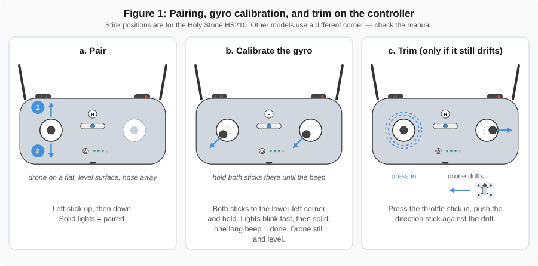
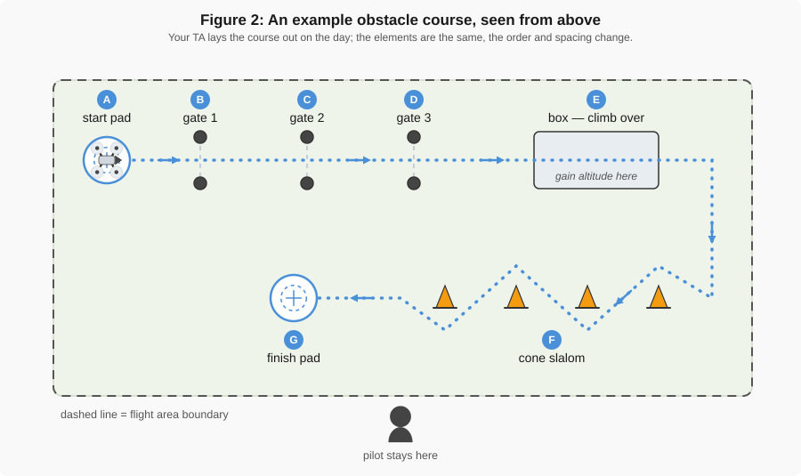

# Flight Practice Lab

!!! abstract "Before this lab, read"
    - [Flight Basics](../gen_reading/flight_basics.md) — the controller, its sticks, and why the nose of the aircraft decides which way "left" means
    - [Common Flight Issues](../gen_reading/flight_issues.md) — what to do when the aircraft does not behave as expected

    You read both of these before [Introduction to Flying](0_intro_to_flying.md). Read the
    orientation and stick-control sections again before this lab. Everything you fly today depends
    on them.

---

## Key Takeaways

1. Deliberate, repeatable control is a skill built by practice, not by reading about it.
2. Stick inputs are relative to the nose of the aircraft, so a pilot has to keep track of the
   aircraft's orientation continuously — not only once it has already become a problem.
3. Small corrections, made one at a time, recover an unsteady aircraft faster than large ones.
4. Most real flight tasks combine several control inputs at once. Smooth flight comes from blending
   them, not from doing one thing at a time.
5. Every mapping flight later in the course is a pattern flown carefully enough to trust the data
   that comes out of it.

---

## Background

In [Introduction to Flying](0_intro_to_flying.md) you learned that the drone can be made to move.
Today's lab is about making it move **where you intended**, again and again, while something else is
also asking for your attention: a course to follow, a teammate calling directions, or a clock.

That matters beyond the mini drone. Later in the semester you will fly a larger aircraft along a
planned grid at a set altitude, taking photographs that overlap by a set amount. A pilot who cannot
hold an altitude or a heading by hand has no way to judge whether an automated flight is going
wrong, and no way to take over when it does. The drone is a measurement instrument, and steady,
deliberate control is the foundation underneath every measurement the course produces.

This lab adds four things to Lab 0: longer flights instead of isolated maneuvers, several control
inputs used together, working with a partner, and — on purpose rather than by accident — recovering
from a mistake. You will practice:

* Holding a controlled hover at a set altitude, and holding that altitude while moving
* Flying a course with obstacles on it, first with the nose fixed and then with the nose following
  the turns
* Flying to another person's spoken directions
* Regaining control after losing track of the aircraft's orientation
* Landing on a marked target

!!! warning "Challenges and races do not change the rules"
    Every safety rule from Lab 0 still applies today, and a score sheet does not suspend any of
    them.

    * Never fly toward a person, including your own teammates and anyone watching.
    * Land immediately when an instructor or TA says to stop, whatever the clock says.
    * No deliberate contact with an obstacle, a wall, or another aircraft. Contact ends the run.
    * A fast run that leaves the flight area is not a run. Staying inside the boundary is part of
      every task on this page.
    * Speed never wins over control. Where time is recorded at all, it is only used to separate runs
      that were already flown cleanly.

!!! danger "Do Not Grab a Flying Drone"
    **Danger:** never try to catch or grab the drone while its propellers are moving, and never
    reach into a course to rescue an aircraft that is still flying. If control is lost, use the
    emergency stop described in the setup review below, and put the safety of the people in the room
    ahead of saving the aircraft.

---

## Objectives

By completing this lab, students will:

1. Maintain a controlled hover at an assigned altitude for a sustained period.
2. Hold altitude while moving the aircraft horizontally.
3. Fly a defined course in both directions without changing the aircraft's heading.
4. Fly the same course while rotating the aircraft to follow the direction of travel.
5. Combine throttle, pitch, roll, and yaw inputs in a single continuous movement.
6. Re-establish control of the aircraft after becoming disoriented.
7. Perform a controlled landing on a marked target.
8. Communicate clearly with a partner acting as a spotter or caller.
9. Explain how deliberate aircraft control affects the quality of the data collected on a mapping
   flight.

---

## Required Materials

1. Holy Stone mini drone and controller
2. Charged batteries — at least three or four per aircraft, plus a charging station running through
   the lab. See the battery note at the end of the setup review.
3. Designated flight area with clearly marked boundaries
4. Course materials: cones, gates or hoops, tape targets, boxes, and marked landing pads
5. Stopwatch or phone timer, one per group
6. Lab worksheet and score sheet
7. Eye protection, if your instructor requires it
8. The manual for your fleet's Holy Stone model, kept at the TA table

---

## Lab Overview

The lab is built as six short activities. Your group rotates through them rather than the whole class
flying the same activity at once, so everyone gets controller time instead of standing in a queue.
Your TA will give you the rotation order for your section.

Every part is flown in **groups**, one group per aircraft. Your TA sets the group size for your
section. On every run one of you is the pilot and one is the caller — the person watching the
aircraft and the room while the pilot watches the controls — and the roles rotate so that everyone
flies and everyone calls. **Every member of the group flies before the group moves to the next
station.** An aircraft in the air always has at least one person besides the pilot looking at it.

One rule covers scoring for the whole lab, so it is stated once here: **control errors cost more
than time.** A run that stays inside the boundary, misses nothing, and lands on the pad is a better
run than a faster one that does not, in every activity below.

**Time budget — 110 minute lab**

| Segment | Minutes |
|---|---|
| Setup, safety briefing, pairing and calibration | 10 |
| Part 1 — Warm-Up: Hover and Altitude Hold | 15 |
| Part 2 — Obstacle Course | 25 |
| Part 3 — Team Flight: Caller and Pilot | 15 |
| Part 4 — Lost Orientation Recovery | 15 |
| Part 5 — Flight Challenges | 15 |
| Part 6 — The Race | 15 |
| Wrap-up, reflection, and put away | 10 |
| **Total** | **110** |

If the room runs long, Parts 5 and 6 are the ones that get shortened.

---

## Setup Review: Pairing, Calibration and Trim

You will fly far more today than you did in Lab 0, and a drone that drifts on its own will ruin
every course on this page. Before the activities begin, each group sets its aircraft up properly.

A **gyro** — short for gyroscope — is the sensor that tells the drone which way is level. Calibrating
it means teaching it what "level" and "still" look like right now. Do this on a flat surface, every
time.

!!! note "Written for the Holy Stone HS210"
    The stick combinations below are the HS210's, the drone used in this course. Other models,
    including other Holy Stone models, use a different corner for calibration, so if you ever fly
    something else, check its manual first. Your TA will demonstrate, and the HS210 manual is at the
    TA table.

1. **Power on in the right order, on a level surface.** Put the battery in the drone. Set the drone
   on a flat, level surface with the nose pointing away from you and the tail toward you. Turn on
   the controller. Push the left stick all the way up, then all the way down, to pair the two.
   Steady lights on the drone mean it is paired.
2. **Calibrate the gyro.** Push both sticks into the lower-left corner together and hold them there.
   The lights blink quickly, then go steady, and the controller gives one long beep when it is done.
   The drone must sit still and level the whole time. A calibration done on a tilted table teaches
   the gyro that tilted is level, and the drone will drift toward the low side all flight.
3. **Recalibrate when anything changes.** Calibrate after pairing, after **any** crash or hard
   landing, and any time the drone drifts while your sticks are centred. Land first. Never try to
   calibrate in the air.
4. **Trim only if calibration does not fix the drift.** With the drone hovering, press the throttle
   stick straight in and hold it, then push the direction stick **against** the drift — drifting
   left, push right; drifting forward, push back. Release when it holds position. One long beep
   confirms the adjustment. Trim in small steps, checking between each one.
5. **Leave the speed switch on Low.** These drones have three speed settings, and the controller
   beeps to tell you which one you are in: one beep for Low, two for Medium, three for High.
   Everything in this lab is flown on Low unless a TA tells you otherwise for the race.
6. **Leave headless mode off.** Headless mode makes the drone move relative to *you* instead of
   relative to its own nose. That is exactly the skill this lab exists to build, so turning it on
   would skip the lesson. If the drone's lights are still blinking after pairing, headless mode is
   on; press the button again to turn it off.
7. **Know the emergency stop before you take off.** Pressing the upper-left and upper-right buttons
   together cuts the motors immediately. Use it if the aircraft heads for a person or if someone
   reaches toward it. Never use it as a normal landing — the drone will simply fall.



*Figure 1: Pairing, gyro calibration, and trim on the controller. Stick positions are for the Holy
Stone HS210; other models use a different corner.*

!!! tip "The engineering version of this habit"
    Calibration is telling an instrument what "level" and "still" mean before you trust anything it
    reports. It is the same thing a surveyor does when levelling an instrument over a point, and the
    same thing you will do with the mapping aircraft in the next lab. An instrument that has not
    been calibrated does not give you obviously wrong answers. It gives you confident wrong answers,
    which are much harder to catch.

**A note on batteries.** These drones fly for roughly seven minutes on a battery and take about
forty minutes to charge. About a minute after the low-battery lights start blinking, the drone lands
itself whether you are ready or not, so plan your battery swaps rather than being surprised by them.
That habit matters much more on a mapping flight, where an aircraft landing halfway through a grid
leaves the data set incomplete.

---

## Activity Instructions

Your TA may adjust any of the layouts below to fit the room and the number of aircraft available.
What does not change is the type of activity, the skill it is practicing, and the rules it is judged
by, which are what each part describes.

### Part 1 — Warm-Up: Hover and Altitude Hold

**Why you are doing it:** to bring back the skills from Lab 0 and to confirm every aircraft is
flying properly before it is asked to do anything demanding.

1. Take off and climb to roughly chest height.
2. Hold a steady hover for 30 seconds.
3. Holding that same altitude, move slowly left, then right, then forward, then back, stabilizing
   between each move.
4. Land on the marked pad.
5. Repeat the whole sequence three times, swapping pilots each time.

While one student flies, another stands off to the side, about 90 degrees around from the pilot, and
calls out any change in altitude. From directly behind the aircraft a pilot cannot see height change
nearly as well as someone watching from the side can.

**How it is judged:** not scored. A TA confirms that each aircraft holds its altitude and that every
student in the group can land on the pad before the group moves on. If an aircraft will not hold
still, go back to the setup review and calibrate it again.

### Part 2 — Obstacle Course

**Why you are doing it:** to combine several control inputs over a route that has a right answer and
a wrong one. This is the syllabus's obstacle course.

The course has five to seven elements laid out by your TA on the day. The example in Figure 2 has
seven, lettered in flight order:

* **A** — take off from the start pad
* **B, C, D** — fly through three gates in turn
* **E** — climb over a box, then come back down to cruising height
* **F** — a slalom between cones
* **G** — land on the finish pad

Your TA may swap elements in or out — a bar to fly under, or a marked box to hold a hover inside for
ten seconds — and will walk you through the real course before anyone takes off.



*Figure 2: An example obstacle course, seen from above. Your TA lays the real one out on the day;
the elements stay the same, the order and spacing change.*

Fly the course **twice with the nose held in one direction** for the whole run, then **twice more
rotating the nose** so that it always points the way the aircraft is travelling. You did exactly this
contrast in Lab 0 Part 4 on an open box pattern. Doing it again is deliberate: the gates and cones
turn a drill into a route, and the difference between the two ways of flying shows up much more
sharply when there is something to miss.

Those two versions feel completely different, and the reason is worth understanding rather than just
noticing. Stick directions are relative to the nose of the aircraft, not to where you are standing,
so turning the nose also changes what "right" does — Figure 9 in
[Flight Basics](../gen_reading/flight_basics.md#stick-controls) shows the same stick input producing
opposite results depending on which way the nose points. A fixed nose makes the sticks predictable
and the turns awkward; a rotating nose makes the turns natural and the sticks harder to trust.

**How it is judged:** completion-based and untimed. Each element you pass cleanly counts. A missed
gate, a touched cone, or a landing off the pad means you retry that element — it does not fail the
run. The goal is four complete runs, not four fast ones.

### Part 3 — Team Flight: Caller and Pilot

**Why you are doing it:** because on a real flight the pilot is rarely the only person watching the
aircraft, and telling another person what to do with a drone is its own skill. This is the syllabus's
team flight activity.

Work within your group, two at a time: one pilot and one caller, with the rest of the group
watching from behind the boundary.

1. The **pilot** stands where they cannot see the target — behind a marker, or facing a direction
   the TA sets.
2. The **caller** stands where they can see both the aircraft and the target, and talks the pilot
   through the route out loud.
3. Fly the route, land, then swap roles and fly it again. Keep rotating until everyone in the group
   has flown and called.
4. Run it a second time under one extra rule: **the caller may only give directions in aircraft
   terms.** "Nose left," "forward," "climb" are allowed. "Toward the window," "over by the door" are
   not.

Afterward, compare the two rounds as a class. Room directions are easier to say and easier to
misinterpret; aircraft directions take more thought from the caller and give the pilot something
they can act on immediately.

**How it is judged:** completion-based. Everyone in the group must both fly the route and call the route.

### Part 4 — Lost Orientation Recovery

**Why you are doing it:** every other activity in this lab is designed so that you do not get
disoriented. This one is designed so that you do — on purpose, in a small room, with a TA next to
you. Losing track of the aircraft's orientation is the most common way a new pilot loses control,
and the first time it happens should not be at a real site with a much larger aircraft.

!!! warning "Before this part begins"
    A TA stays within arm's reach of the pilot for every run in this part, and the emergency stop
    combination is confirmed out loud before the first takeoff. If the aircraft turns toward a
    person, the TA calls the stop and the pilot presses it. Nobody reaches for a flying drone.

**Exercise 1 — the 180.** Take off and fly a short leg away from yourself. On the TA's word, yaw the
aircraft 180 degrees so the nose points straight back at you, then fly it to a landing pad placed
behind your own position and land. Your left and right are now reversed, and the only way through is
small inputs, one at a time, checking the result before making the next one.

**Exercise 2 — stop and re-orient.** Fly the same short route. At a moment of the TA's choosing they
call "stop". Bring the aircraft to a stable hover, say out loud which direction the nose is pointing,
and continue once the TA confirms.

Talk about what happened afterward. In particular: what was the aircraft doing while you worked out
which way was which? Both readings give the same advice — stop making big inputs, stabilize, work
out the orientation, and only then continue. [Common Flight
Issues](../gen_reading/flight_issues.md) puts it plainly: an aircraft doing something you do not
understand will not start making sense if you keep flying it.

**How it is judged:** not scored, and deliberately so. Success is a stable hover and a correct call
of where the nose is pointing. Taking a long time to work it out is a good outcome, not a bad one.

### Part 5 — Flight Challenges

**Why you are doing it:** short tasks that isolate one skill each, so you find out which ones you
actually have. These are the syllabus's flight challenges.

Your TA will set up three or four stations. Each is a single task with a clear pass condition.
Typical stations:

* **Hover box** — hold a hover inside a one-metre (about three-foot) square for 30 seconds without
  leaving it
* **Small target landing** — land on a target about the size of a sheet of paper
* **Figure eight** — fly a figure-eight path around two cones
* **Payload run** — carry a light payload, such as an empty paper cup, through a gate without
  dropping it
* **Called headings** — hold a marked altitude while the TA calls out headings for you to yaw to

**How it is judged:** pass or retry, station by station, recorded on your worksheet. There is no
penalty for a retry. If time is short, choose the stations you found hardest earlier in the lab, not
the ones you know you can already do.

### Part 6 — The Race

**Why you are doing it:** the syllabus's race, and the clearest demonstration of the point this whole
lab is built around — that speed without control is not a result.

Groups fly a shortened version of the Part 2 course, one pilot at a time, as a relay. Every member
of the group flies at least one leg. Your TA will set the format based on the room and the number of
aircraft available.

**How it is judged:** completion first. A leg counts when the aircraft passes every element, stays
inside the boundary, contacts nothing, and lands on the pad, and a group's result is the number of
clean legs it flew. **Time is only used to separate groups whose runs were equally clean.** A leg
with a missed gate or a touched cone is not redeemed by being fast.

If the room is running well, your TA may finish with a head-to-head or timed round for fun. The
rules do not change for it: a fast run that touches a cone still loses to a slower clean one.

That is the same rule that applies to the data you will collect later. A flight finished quickly but
flown badly produces measurements nobody can use, which is much the same as not having flown at all.

---

## In Lab Reflection

Before leaving the lab, think about the following questions:

* Which was harder — flying the course with the nose fixed, or rotating the nose at each turn? Why?
* When you lost track of which way the drone was facing, what did you actually do first?
* What did your partner see from the side that you could not see from behind the aircraft?
* Where did you find yourself overcorrecting, and what stopped it?
* Did the race change how you flew? Did it make your flying better or worse?
* A mapping flight has to hold a set altitude and a set path for the whole flight to produce usable
  data. Which part of today's lab would be hardest to do that carefully for ten minutes straight?

You will be asked to answer these questions in the Learning Suite quiz associated with this lab.

---

## Homework

Complete the following assignment after the lab. You will submit your answers in the Learning Suite
quiz associated with this lab.

### Part 1 — Course Sketch and Control Plan

Sketch the obstacle course from Part 2 as you flew it, marking the start pad, each element, and the
landing pad. Then pick **three** elements and write one or two sentences on each, covering:

* Which control input, or combination of inputs, the element required
* Where the nose of the aircraft was pointing at that moment
* Whether that made the element easier or harder, and why

For example:

```text
Element C (cone slalom): roll left and right with small pitch inputs to keep moving forward.
Nose stayed pointed down the course, so left on the stick was left from where I stood. Easier
that way than on the run where I turned the nose at each cone.
```

### Part 2 — Connect It to the Reading

Choose **one** of the following:

* A situation from [Common Flight Issues](../gen_reading/flight_issues.md) — drift with the sticks
  centred, losing track of orientation, or an aircraft not responding the way you expected.
* An idea from [Flight Basics](../gen_reading/flight_basics.md#stick-controls) — most likely the
  rule that the nose, not the pilot, decides which way "left" is.

Then write a short response that:

1. Describes a specific moment in the lab where it applied.
2. Says what you actually did at the time.
3. Says what the reading advises a pilot to do.
4. If those two are different, says which one you would do next time, and why.

!!! tip "Think Beyond the Mini Drone"
    A mistake with a mini drone indoors costs a propeller at worst. The same mistake with the
    aircraft you will fly later in the course costs a flight, a data set, and possibly more than
    that. The point of writing this up is to make the correction a habit while it is still cheap to
    practice.

---

## Looking Ahead

Next: [Week 4 lab — Flight Checklist](1_flight_checklist.md).

Today you flew by feel, with a TA watching. The next lab turns the procedure *around* the flight
into something written down: a pre-flight, during-flight, and post-flight checklist that another
person could follow. It also introduces the larger aircraft those procedures exist for, along with
their batteries, controllers, and calibration routines.

The calibration you did at the start of today's lab is the small version of that. On a larger
aircraft the same idea covers the compass, the satellite fix, the home point, and the camera, and
skipping any one of them is how a flight ends up producing data nobody can trust.

That is the thread running through this course: control first, procedure next, then measurement.
