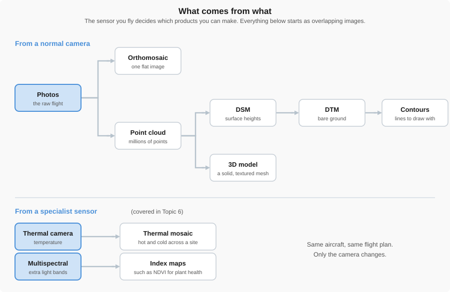
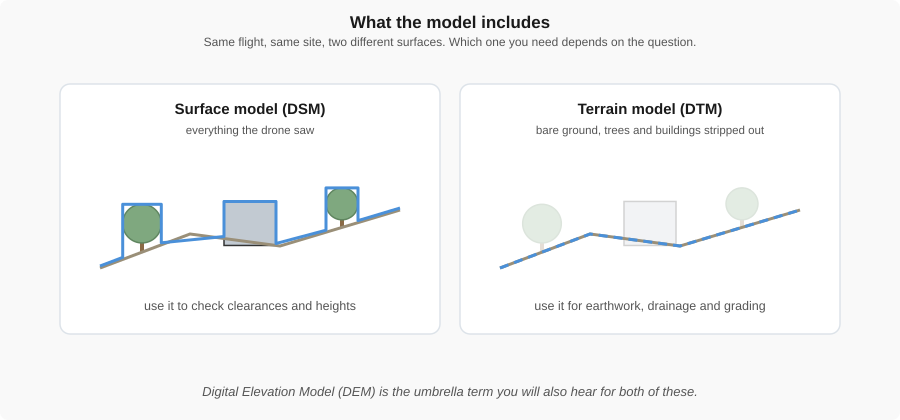
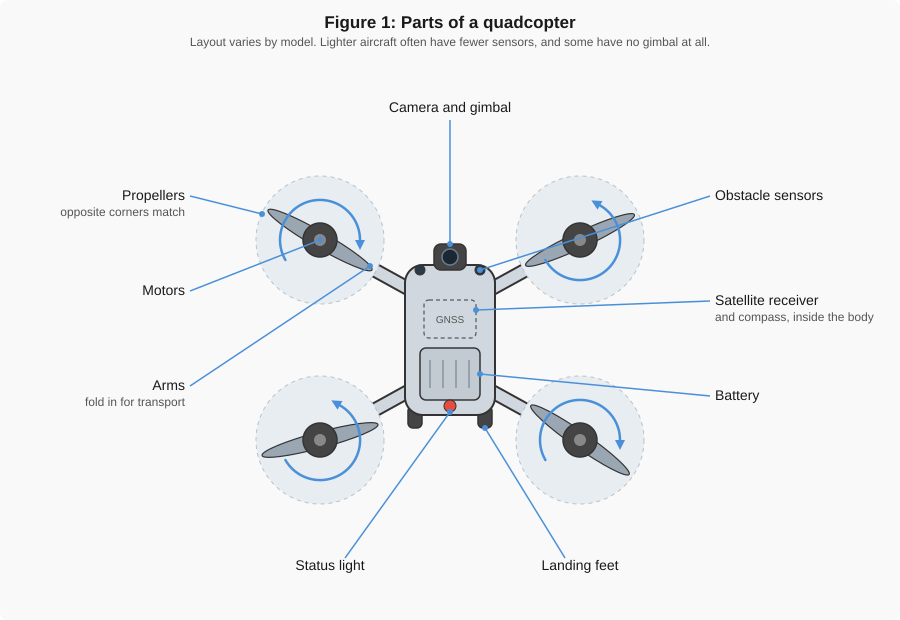
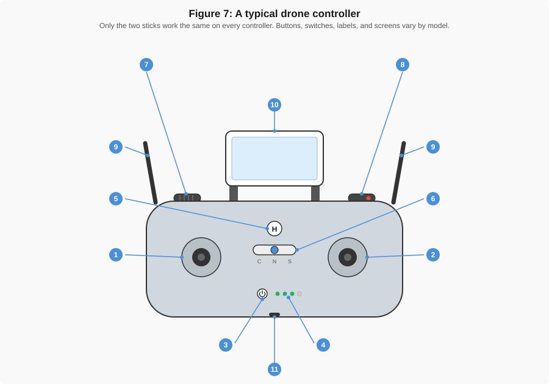
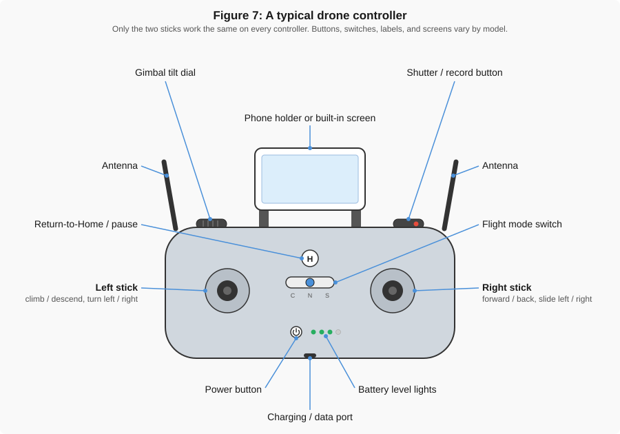
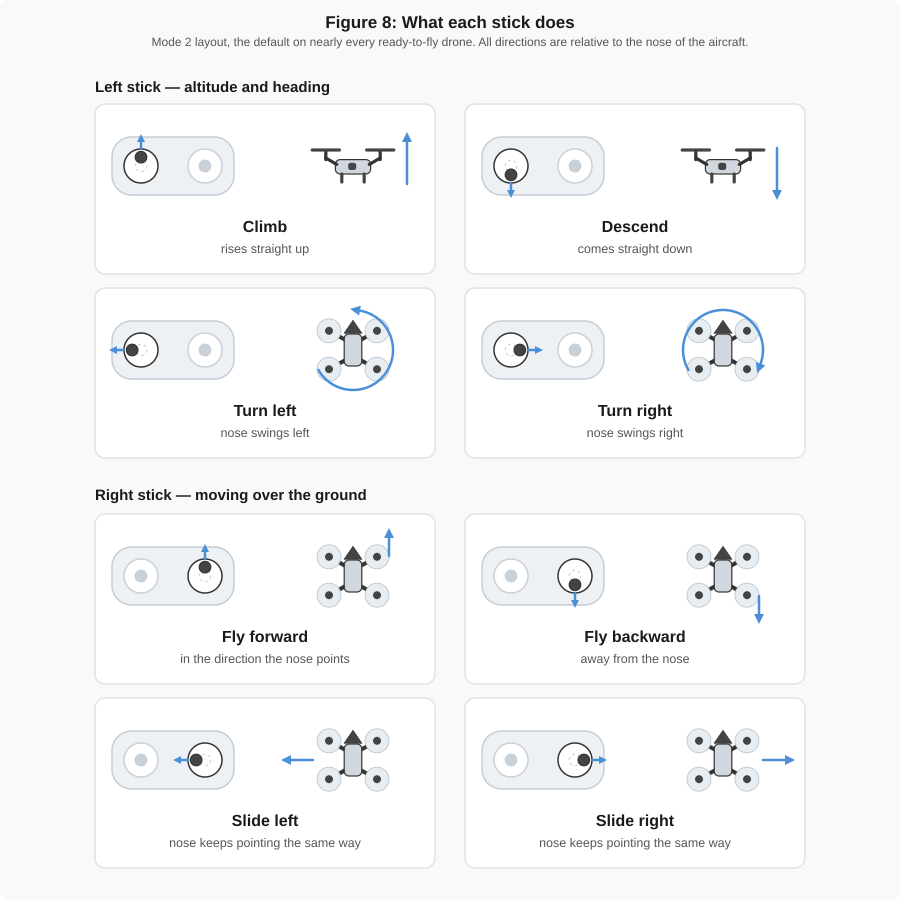

<!-- _class: title -->

# Week 2 — Drone Applications and Basic Flight

## CCE 194R — Aerial Measurement

---

## A drone is a measuring instrument

One flight already gives you a map, a surface, and a number.

Photos become a map, a surface, or a number — pick the product the question needs.

By the end of this half you will know which of these to ask for.

---

## What comes from what

Every product below starts from the same overlapping photographs.

Each step trades some detail for something easier to use.

---

## Orthomosaic

Every photo stitched into one flat, scaled image — distance, area, position, counting things.

---

## Point cloud and 3D model

Millions of 3D points, or a textured mesh — shapes, clearances, and client walkthroughs.

---

## DSM or DTM?

Same site, two different answers about the ground.

DSM keeps the trees and buildings. DTM strips them out — only one is right for earthwork.

---

## Contours, thermal, index maps

- **Contours** — lines of equal elevation, for grading plans
- **Thermal** — temperature instead of color, for heat loss and moisture
- **Index maps** — plant health and bare ground, such as NDVI

---

<!-- _class: prompt -->

# Which product would you want?

**Groups of 3. Name the product, and say why. 4 minutes.**

1. How big is this parking lot?  2. How much dirt is in that stockpile?
3. Where will water collect after a storm?  4. Will the crane clear that roof?
5. What did this site look like last month?  6. Is heat escaping from that roof?
7. Which part of this slope is not growing back?  8. What do I show the client?

---

## Answers

1. **Orthomosaic** — area is a flat, 2D question
2. **DSM or point cloud** — you need the height of the pile
3. **DTM** — water follows the bare ground, not the trucks on it
4. **Point cloud or DSM** — the roof itself is the obstacle
5. **Orthomosaic from that date** — same product, earlier flight
6. **Thermal mosaic** — only that sensor measures temperature
7. **Index map** — plant health is a band ratio
8. **3D model or orthomosaic** — whichever reads fastest

The two hardest calls, 2 and 3, are exactly DSM versus DTM.

---

## The aircraft

Four rotors, two spinning each way — that's the only control there is.

The camera, gimbal, and satellite receiver decide your data quality. Everything else holds them steady.

---

<!-- _class: prompt -->

# Name the numbered controls

---

## The controller

Left stick: throttle and yaw. Right stick: pitch and roll. RTH is your safety net.

---

## Left stick — throttle and yaw

Climbs, descends, and turns the nose left or right.

Push up to climb, push left or right to yaw the nose.

---

## Right stick — pitch and roll

Moves the aircraft forward, back, left, and right over the ground.

Push forward to pitch ahead, push sideways to roll left or right.

---

## The nose decides left and right, not you

Stick directions are relative to the nose of the aircraft.

Flying away from you, its left matches yours. Turn it around and everything reverses.

---

<!-- _class: prompt -->

# Nose pointed at you

You push the right stick right. Which way does the aircraft go?

---

## To your left

The nose is facing you, so the aircraft's right is your left.

Stick directions are always relative to the nose — never to where you're standing.

---

## Takeoff, hover, land

Small inputs beat big ones — every time.

Hover a few seconds after takeoff and check the aircraft responds the way you expect.

---

## Return to Home

Button press, low battery, or lost signal — all three trigger the same flight.

It flies a straight line home. Set RTH altitude above the tallest thing on site, or it flies into it.

---

## Which features does your drone have?

| Feature | Toy | Consumer | Professional |
|---|---|---|---|
| Satellite positioning | rarely | yes | yes |
| Holds position unassisted | no | yes | yes |
| Return to Home | no | yes | yes |
| Obstacle sensors | no | some | usually all-round |
| Interchangeable payloads | no | no | yes |

The sub-250 g drones in this class are consumer aircraft, not toys.

---

## Thursday: Lab — Intro to Flying

Holy Stone mini drones, indoors. No TRUST certificate, no flying.

- Identify the basic controls
- Follow pre-flight safety procedures
- Take off, hover, and land safely
- Move forward/back, left/right, and yaw
- Track orientation as the nose turns
- Build habits for the bigger drones ahead

---

## Before next week

- Read [FAA Part 107 Overview](../part_107_license/faa_exam_planning_and_overview.md)
- Read [Common Flight Issues](../gen_reading/flight_issues.md)
- Week 3 lab: Flight Practice — you calibrate the drone yourself
