<!-- _class: title -->

# Using QGIS

## Week 4 — Tuesday Lecture

---

## Today

- What a GIS is, and why an orthomosaic is a measuring instrument
- Installing QGIS — before Thursday
- Loading an orthomosaic and checking the coordinate reference system
- Two ways to measure: the quick one, and the one you can hand in

---

<!-- _class: prompt -->

# A picture, or a measurement?

An aerial photo shows you a parking lot. An orthomosaic in a GIS tells you it is **27,856 ft²**.

What has to be true of the image for that number to mean anything?

---

## GIS is a database with a map on the front

- Every pixel of an **orthomosaic** has a real-world coordinate
- So a click on the screen is a **position**, two clicks are a **distance**, and a closed shape is an **area**
- **QGIS** is the free, open-source GIS we use to take those measurements

The number is only as good as the image under it and the coordinate system it is drawn in.

---

## Install QGIS

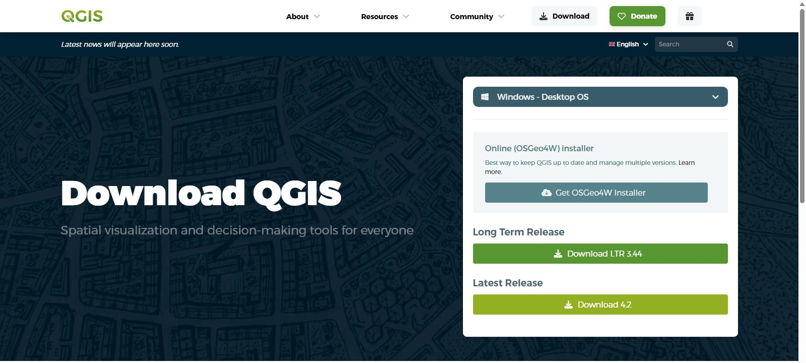

qgis.org → Download → <strong>Long Term Release (LTR)</strong>. Windows: run the .msi and keep the defaults.

---

## It will ask for a donation first

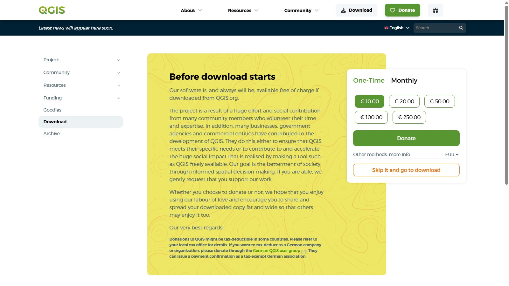

Not required. Click <strong>Skip it and go to download</strong>.

---

## Load the orthomosaic

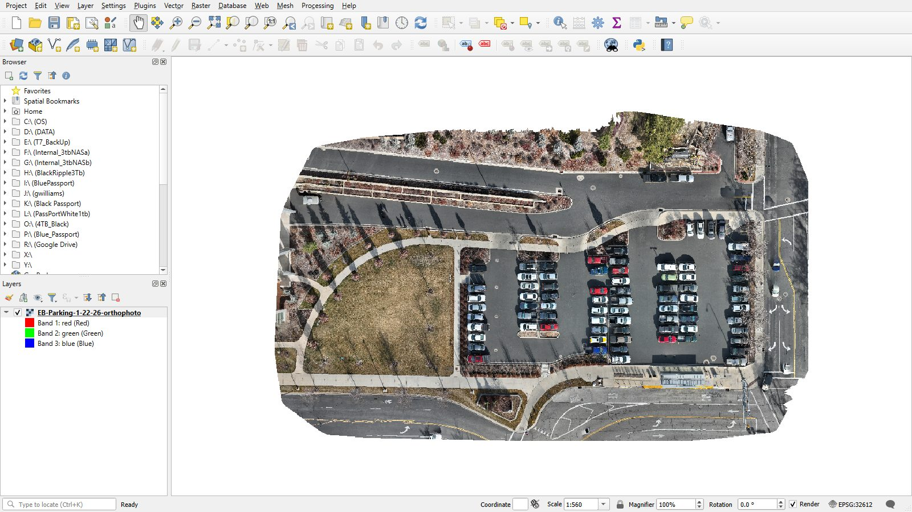

New empty project, then drag the .tif onto the map. Layers panel on the left; the CRS in the bottom-right corner.

---

## Zoom in

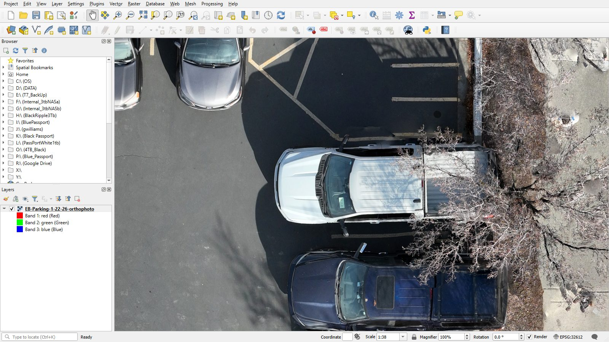

One-centimetre pixels. You can see the stripe, the curb, and the bumper — and that matters for where you click.

---

## Same lot, two images

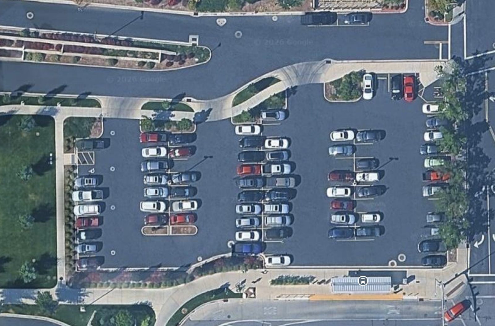

Google Maps satellite imagery (© Google)

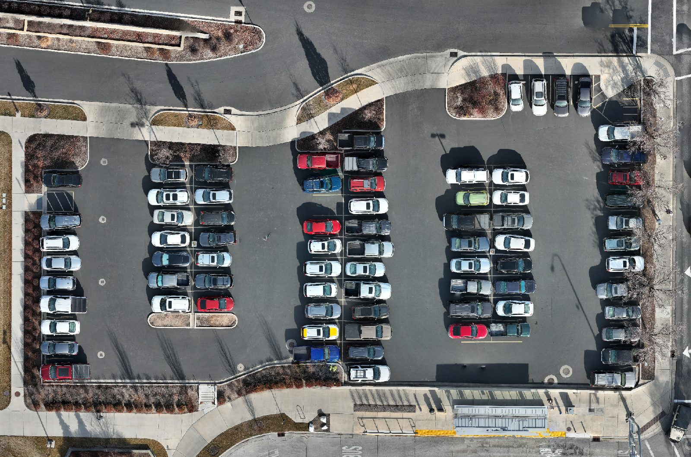

Drone orthomosaic, January 2026, 1 cm pixels

---

<!-- _class: prompt -->

# Where does the pavement end?

Zoom in on both. Which one lets you put the cursor on the curb with confidence — and how much area is one metre of doubt around the whole lot?

---

## The coordinate reference system

- A **CRS** is how the round Earth is flattened onto your screen
- **Geographic** CRS (plain WGS 84, `EPSG:4326`): units are **degrees**
- **Projected** CRS (WGS 84 / UTM zone 12N, `EPSG:32612`): units are **metres**

Measure in degrees and every number you write down is meaningless. Check the corner **before** you measure.

---

## The corner tells you

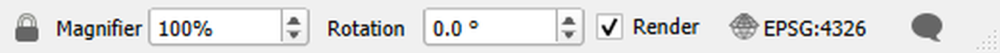

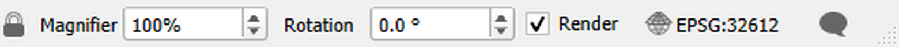

Same project, two settings. Top: degrees — do not measure. Bottom: metres — go ahead.

---

## Set the project CRS

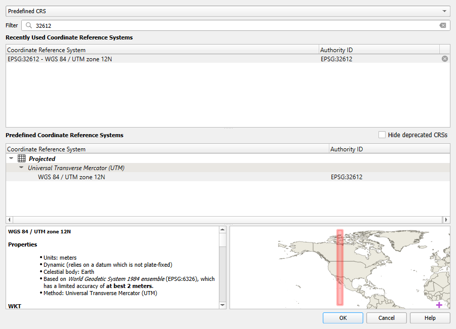

Click the corner (or Project → Properties → CRS), type <strong>32612</strong>, pick WGS 84 / UTM zone 12N.

---

## Set the units you will report in

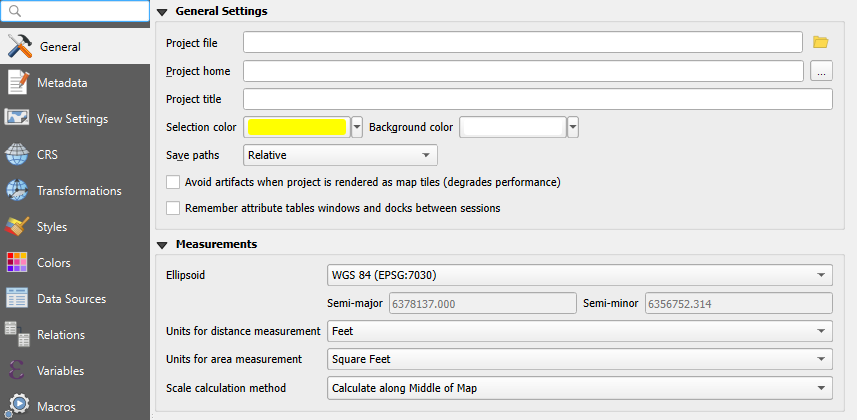

Project → Properties → General → Measurements: <strong>feet</strong> and <strong>square feet</strong> for the lab worksheet.

---

<!-- _class: prompt -->

# A parking lot of 0.00002

That is what a student's area comes out as, every semester. What happened, and what is the unit?

---

## Measure a distance

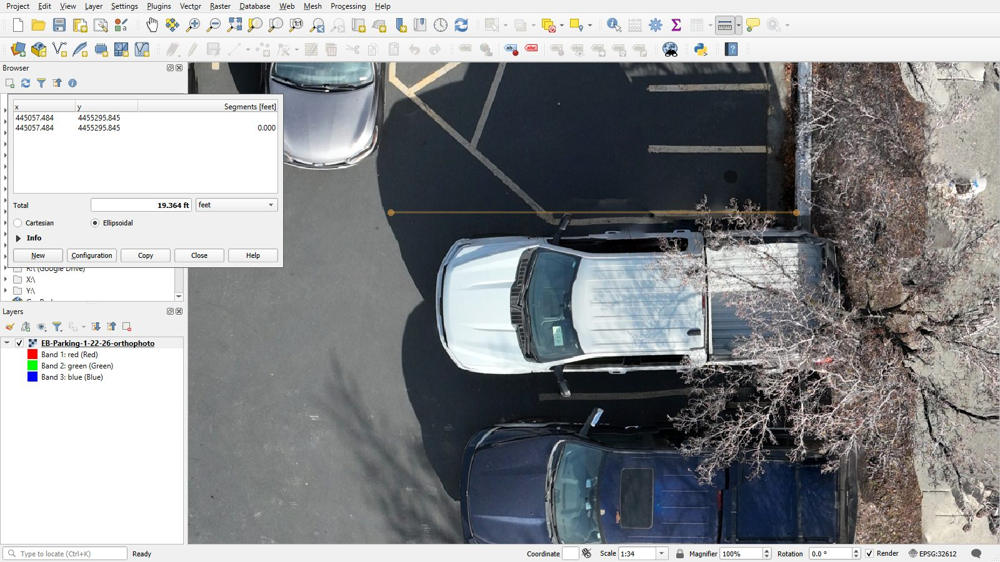

Ruler icon or Ctrl+Shift+M. Click, click, <strong>right-click</strong> to finish. One stall: 19.4 ft.

---

## Measure an area

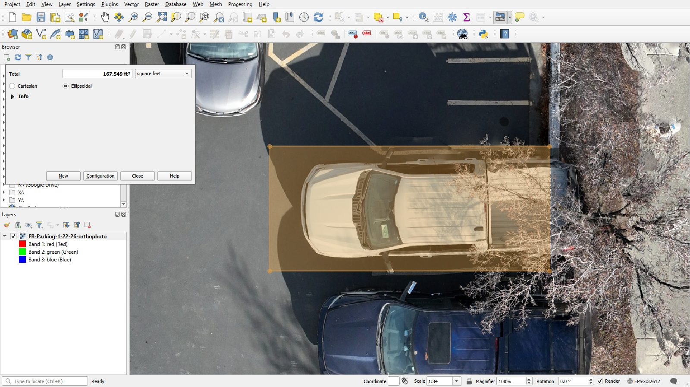

Measure Area from the ruler's drop-down. Click each corner, right-click to close. One stall: 167.5 ft².

---

<!-- _class: prompt -->

# The ruler challenge

Measure the stall in **metres**. Switch the units to **feet** and measure it again.

Did the number change? Did the stall?

---

## The Measure tool forgets

The number is on screen, and then it is gone.

For anything you have to **defend** — a lab result, a quantity in a report — draw the shape instead:

1. Create a polygon layer
2. Trace the feature
3. Let the Field Calculator compute the area

The shape is saved with the project. Reopen it, fix one edge, hand it in.

---

## Create a polygon layer

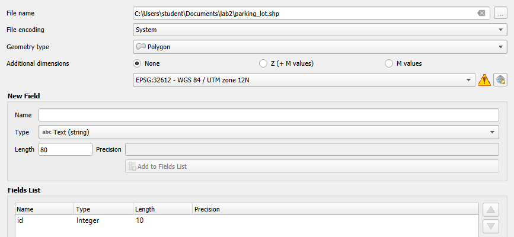

Layer → Create Layer → New Shapefile Layer. Geometry <strong>Polygon</strong>, CRS <strong>EPSG:32612</strong>, a file name you can find again.

---

## Trace the feature

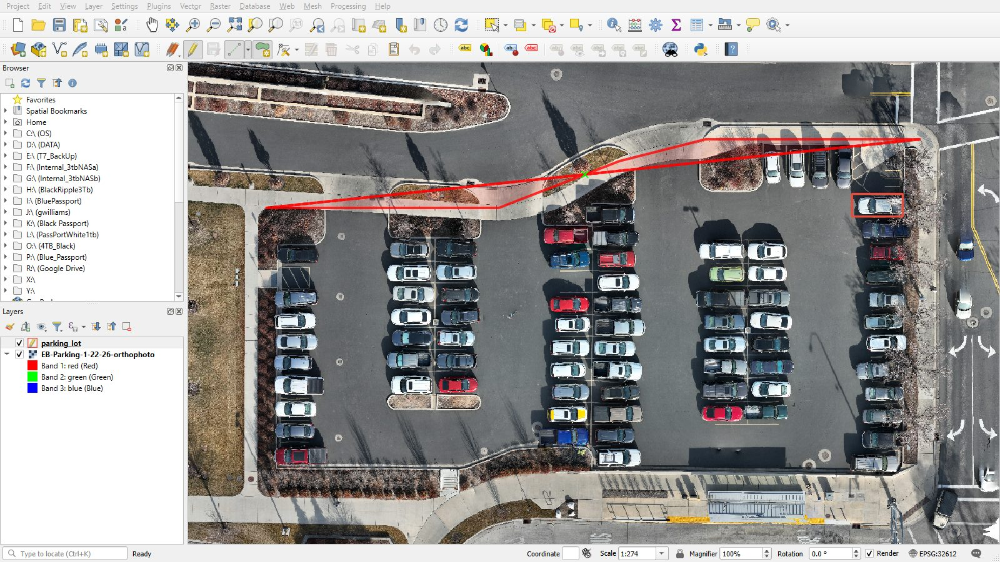

Toggle Editing (pencil), Add Polygon Feature, click along the asphalt edge, right-click to close. Asphalt only — no sidewalk, no grass.

---

## Save it

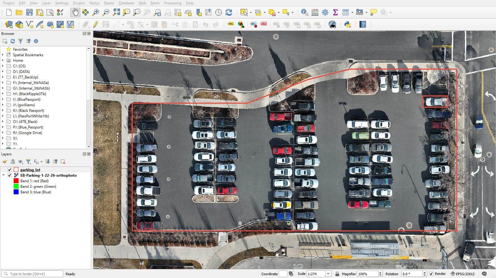

Toggle Editing off and save. Two shapes on record: the stall and the lot.

---

## Compute the area

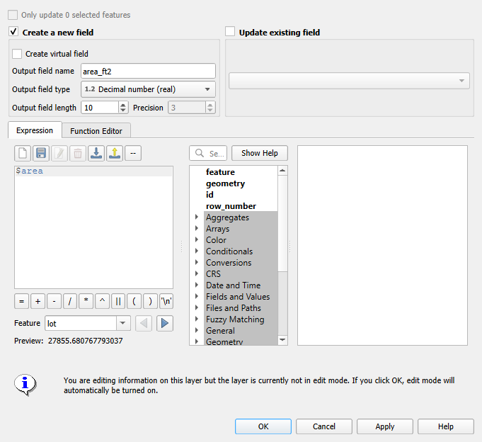

Open the Attribute Table, then the Field Calculator (abacus). New field <strong>area_ft2</strong>, decimal, expression <strong>$area</strong>.

---

## Read it off

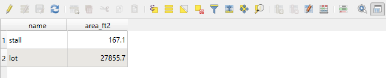

Stall 167.1 ft², lot 27,856 ft². These are the numbers that go on the worksheet.

---

## Two methods, one feature

| Method | Stall area |
|---|---|
| Measure tool | 167.5 ft² |
| Digitized polygon + `$area` | 167.1 ft² |

They agree to a quarter of a percent. If yours differ by a factor of thousands, **check the CRS first** — nothing else produces a mistake that large.

---

## Thursday

- **Install QGIS before lab** — the download is large and the lab Wi-Fi is not
- Bring a laptop; the orthomosaic download is on the lab page
- You will pace the lot, measure it in Google Maps, then measure it in QGIS — and compare all three

[Measurements and Methods](../labs/2_measurements_and_methods.md) · [Using QGIS](../software/qgis_measurements.md)
