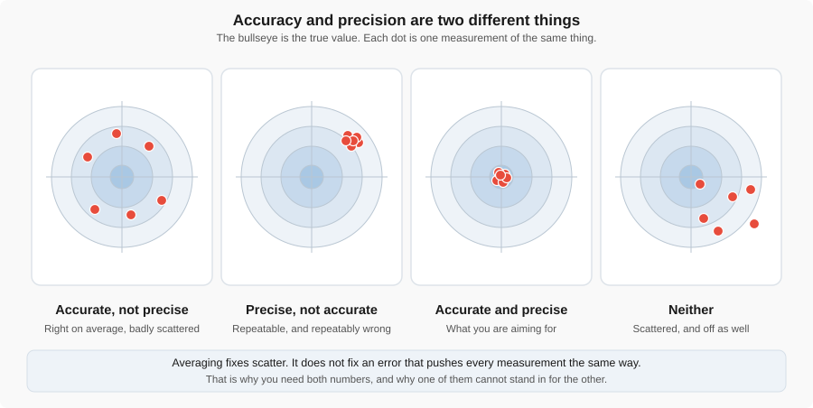
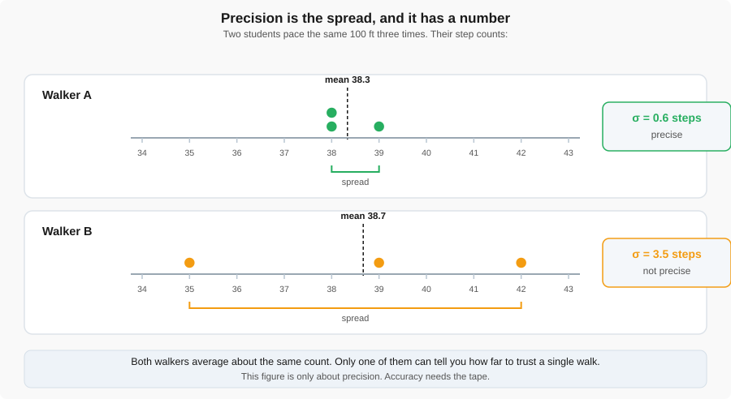
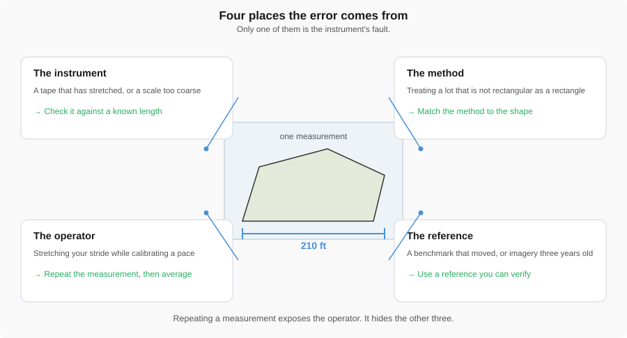
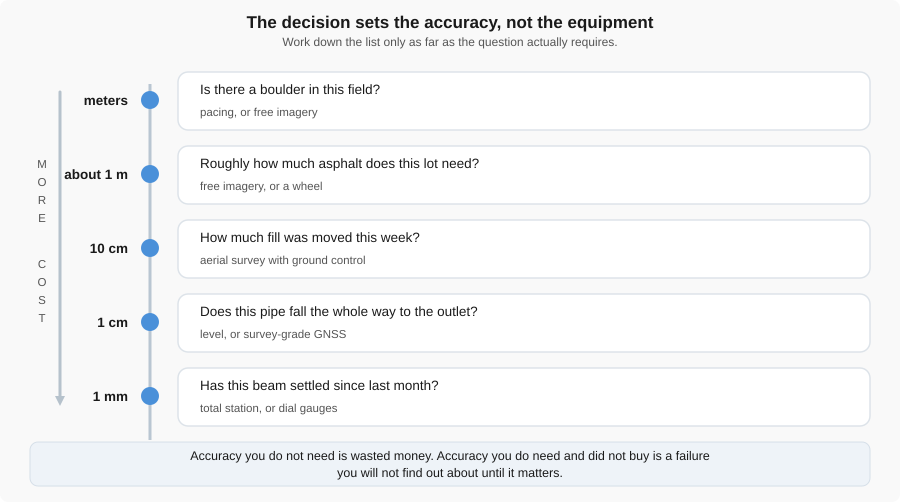
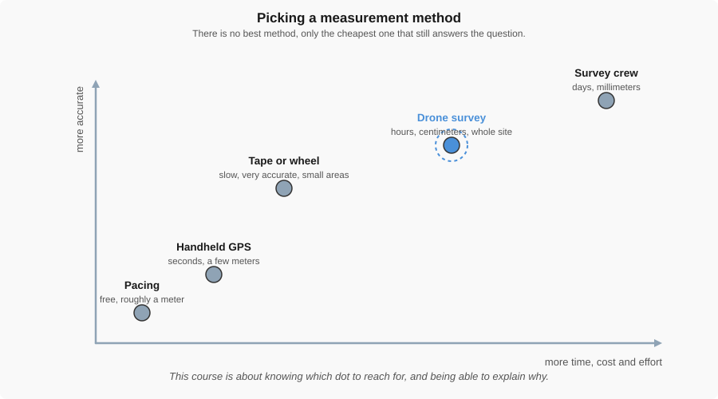
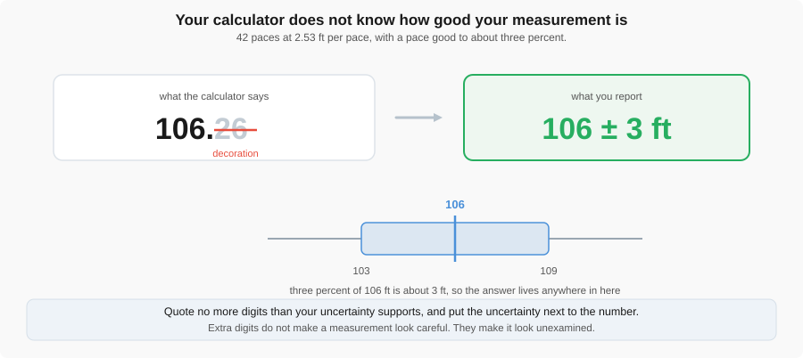
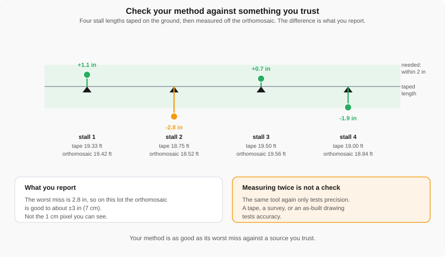
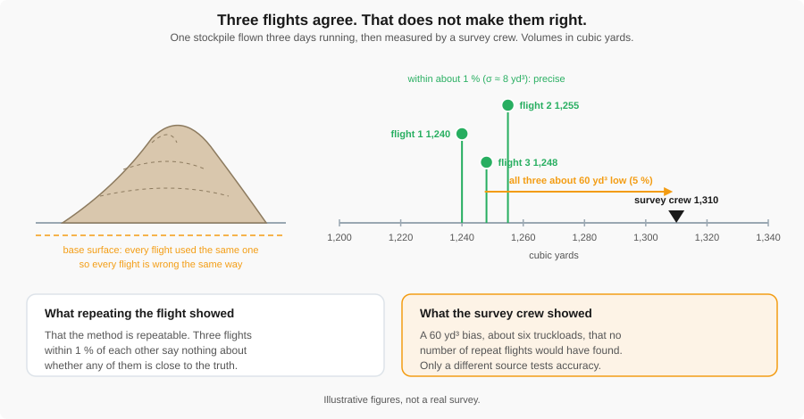

<!-- _class: title -->

# Measurement Fundamentals

## Week 5 — Tuesday Lecture

---

## Today

- Accuracy, precision, and resolution — three different things
- Where measurement error actually comes from
- How much accuracy a decision needs
- Reporting a number you can defend
- Checking it against something you trust

---

## The question this course asks

**"The lot is 210 feet long"** — an assertion.

**"210 ± 6 feet"** — a measurement.

Every method in this course, from pacing to a drone, is judged by the same test.

---

<!-- _class: prompt -->

# How good is this number?

You will not know until you can answer that with a range, not a single value.

---

Accurate means close to the true value. Precise means the repeats agree.

---

## Three different things

- **Accuracy** — how close to the true value. Errors are usually **systematic**.
- **Precision** — how closely repeats agree with each other. Errors are usually **random**.
- **Resolution** — the smallest difference the instrument can show you.

Averaging fixes scatter. It does not fix a result that is consistently off.

---

## Precise, and wrong

A 100-ft steel tape has stretched half a percent. Laid along a true 100.00 ft it reads:

**99.50 &nbsp; 99.52 &nbsp; 99.49 ft**

| Property | This tape |
|---|---|
| Resolution | 1/16 in — excellent |
| Precision | $\sigma \approx 0.2$ in — excellent |
| Accuracy | every reading **6 in short** |

Nothing in the three readings tells you. Only a different tape would.

---

<!-- _class: prompt -->

# Which walker would you trust for a single walk?

Walker A: 38, 39, 38 steps &nbsp;&nbsp;&nbsp; Walker B: 35, 42, 39 steps

---

Same average, very different spread — only one walker is precise.

---

## Walker A's standard deviation

$$
\bar{x} = \frac{38+39+38}{3} = 38.33
$$

$$
\sigma = \sqrt{\frac{(-0.33)^2+(0.67)^2+(-0.33)^2}{3-1}} = \sqrt{0.33} \approx 0.6 \text{ steps}
$$

A tight $\sigma$ on an average near 38 — Walker A is precise. This says nothing yet about accuracy.

---

Instrument, method, operator, reference — repeating a measurement only exposes one.

---

## Trace it three times

The same lot in Google Maps, three careful traces:

**27,600 &nbsp; 28,100 &nbsp; 27,850 ft²** &nbsp;&nbsp; $\sigma \approx 250$ ft², about 1 %

That spread is the **operator** — how steadily you follow the edge.

The date in the corner of the image is the **reference**. If the lot was restriped after the photo, every trace is wrong the same way.

Which of the four boxes does careful tracing fix? Which does it not touch?

---

## Turning a percent into a range

A calibrated pace is good to about **3%**.

$$
3\% \times 210\text{ ft} \approx 6\text{ ft}
$$

Report **210 ± 6 ft** — not a bare 210.

---

<!-- _class: prompt -->

# Boulder, or beam?

"Is there a boulder in this field?" and "has this beam settled?" do not need the same accuracy.

---

The decision sets the accuracy needed — meters down to millimeters.

---

## 1.2 inches over two acres

A pad is flown before and after a week of grading. Every elevation in the second flight is **1.2 in (3 cm) high** — invisible at any one point.

$$
87{,}000\text{ ft}^2 \times 0.1\text{ ft} \approx 8{,}700\text{ ft}^3 \approx 320\text{ yd}^3
$$

About **thirty truckloads** of fill that was never placed, at the contractor's unit rate.

A small systematic error, multiplied by a large area.

---

Accuracy rises with effort, but not smoothly — pick the method the decision needs.

---

<!-- _class: prompt -->

# Pace it off, or fly it?

A pair of boots and a drone both answer some question correctly, and both answer some question wastefully.

---

Your calculator does not know how good your input was.

---

## 106.26, or 106 ± 3?

42 paces at a calibrated 2.53 ft/pace:

$$
42 \times 2.53\text{ ft} = 106.26\text{ ft}
$$

Pace is good to about 3% $\Rightarrow$ about ±3 ft.

**Report 106 ± 3 ft.** The extra digits are decoration, not confidence.

---

Your method is as good as its worst miss against a source you trust.

---

Three flights within 1 %, the survey 5 % away. Repeating tested precision; only the survey tested accuracy.

---

<!-- _class: prompt -->

# Is that a check?

You measured the lot twice in QGIS and got the same number both times.

---

## What to do Thursday

You measure the same lot three ways. Each one's check is a **different** method.

| Method | Its precision comes from | Its check |
|---|---|---|
| Pacing | Your stride and the surface | The taped 100 ft |
| Google Maps | How steadily you trace | The orthomosaic, or a tape |
| Orthomosaic in QGIS | How carefully you trace | Taped stalls; surveyed points |

Pace your calibration distance **three times** and bring your $\bar{x}$ and $\sigma$ to [Measurements and Methods](../labs/2_measurements_and_methods.md).
