<!-- _class: title -->

# Planning the Flight

## Week 6 — Tuesday Lecture

---

## Today

- Why a bad flight cannot be fixed by software
- How high, how much overlap, what pattern, which way to point the camera
- Getting the **sides** of a building into the frame
- Hard constraints first, and flight time by hand
- The class flight planner you will use Thursday

---

## The photos are the ceiling

- Every product — orthomosaic, surface, 3D model — is built from the photos you bring back
- Processing can only find what the camera saw, as sharply as it saw it
- Planning decides the pixel size, the overlap, the pattern, and how long you are in the air

Thursday you plan four missions in the class planner. Today is why the numbers are what they are.

---

<!-- _class: prompt -->

# What is the smallest thing this map has to show?

Answer that first. Every other number follows from it.

---

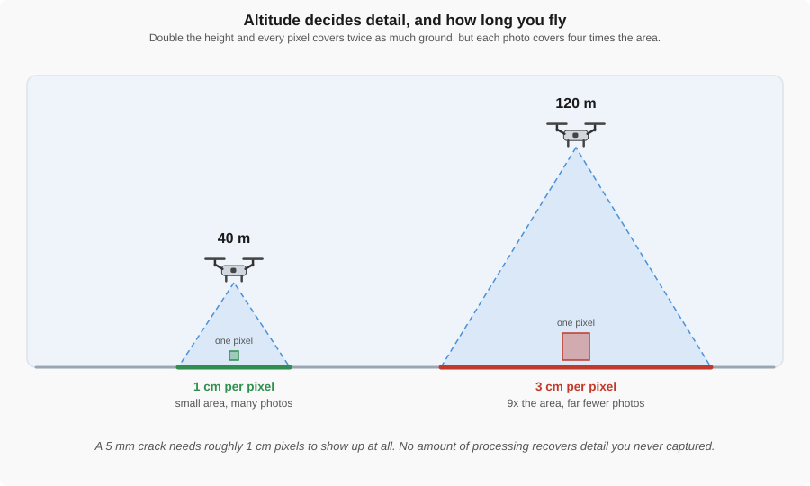

Flying twice as high doubles the size of every pixel, but each photo covers four times the area.

---

## Height is the dial

- **Ground sample distance (GSD):** the real-world size of one pixel
- A 3-in divot at 1.5 cm per pixel is about five pixels across — visible. At 5 cm it is one pixel — gone.
- Choose the GSD that resolves the smallest feature, then fly at the **highest** altitude that still delivers it

Lower is not better. Lower is more photos, more lines, more batteries, and more hours of processing.

---

<!-- _class: prompt -->

# The tradeoff game

A 50-acre site. You need drainage **and** 5 mm cracks.

20 minutes at 120 m (4 cm GSD), or 60 minutes at 40 m (1 cm GSD). Your battery lasts 25 minutes. What is your plan?

---

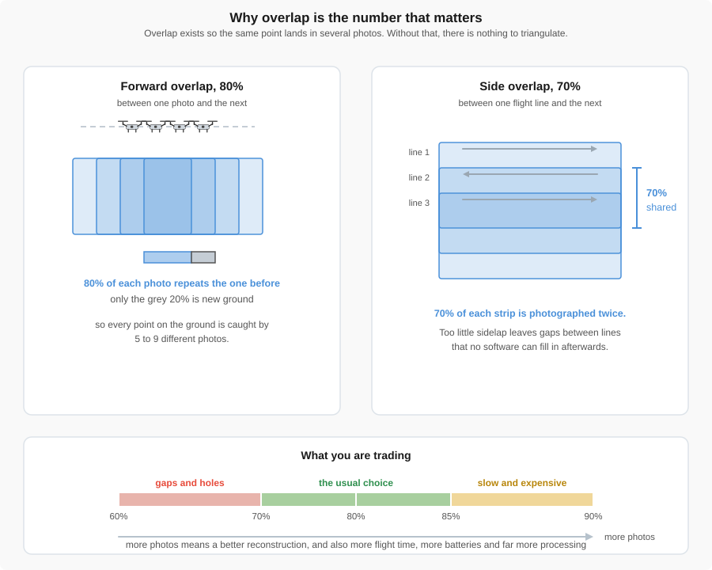

Overlap exists so the same point lands in several photos. Without that, there is nothing to triangulate.

---

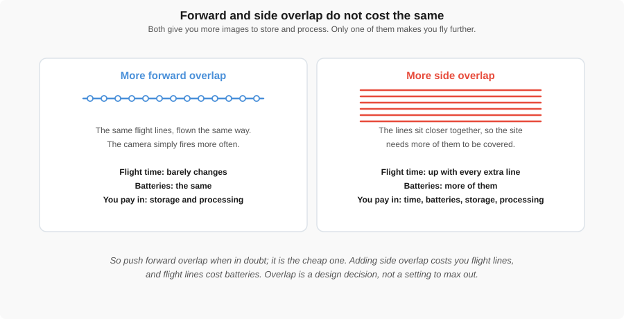

More forward overlap is more photos on the same lines. More side overlap is more lines, and every line costs battery.

---

## How much overlap

| Site | Forward | Side |
|---|---|---|
| Open, flat, textured ground | 70 % | 60 % |
| **General mapping** | **80 %** | **70 %** |
| Tall vegetation, complex structures | 85 % | 80 % |
| Repeating patterns: parking lots, row crops, grass | 85 % | 80 % |

Above about 85 % there is little left to gain.

---

<!-- _class: prompt -->

# Which overlap is the cheap one?

Forward or side? Why does it matter which one you raise first?

---

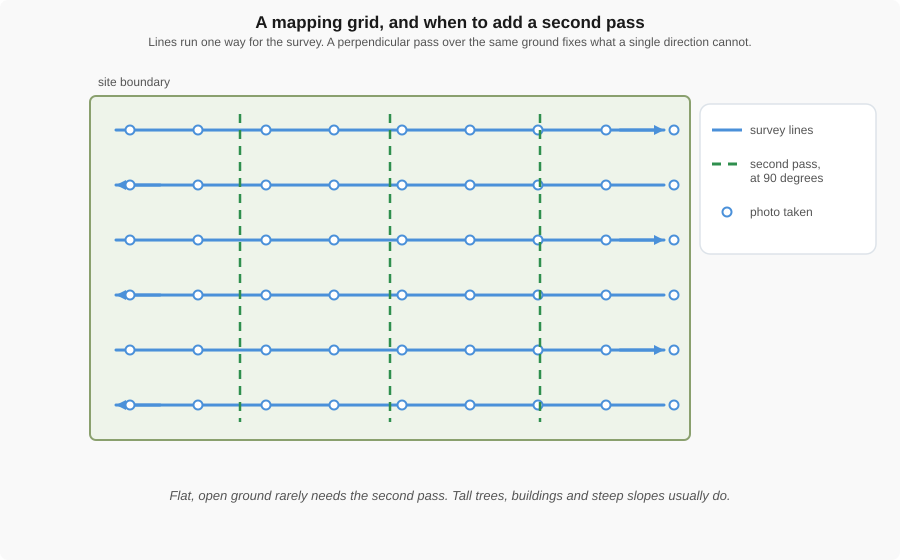

Parallel lines, alternating direction. A second pass at ninety degrees only when the site needs it.

---

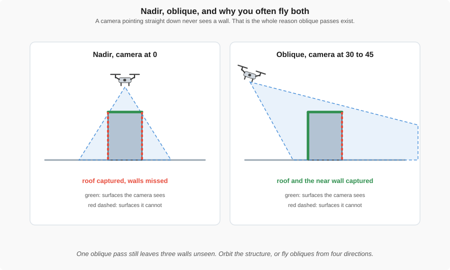

A nadir camera sees the roof and nothing else. Tilting it to 30 or 45 degrees brings the near wall into view.

---

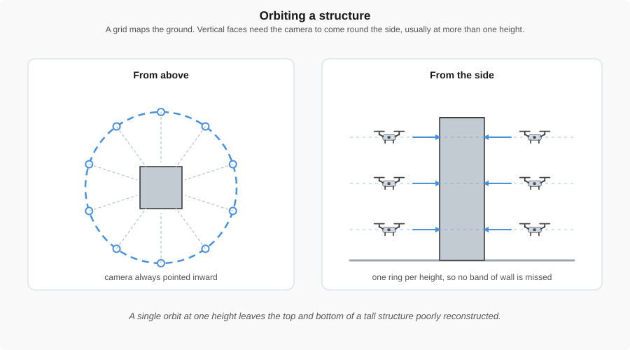

The camera points inward and circles the structure. Tall structures need a ring at more than one height.

---

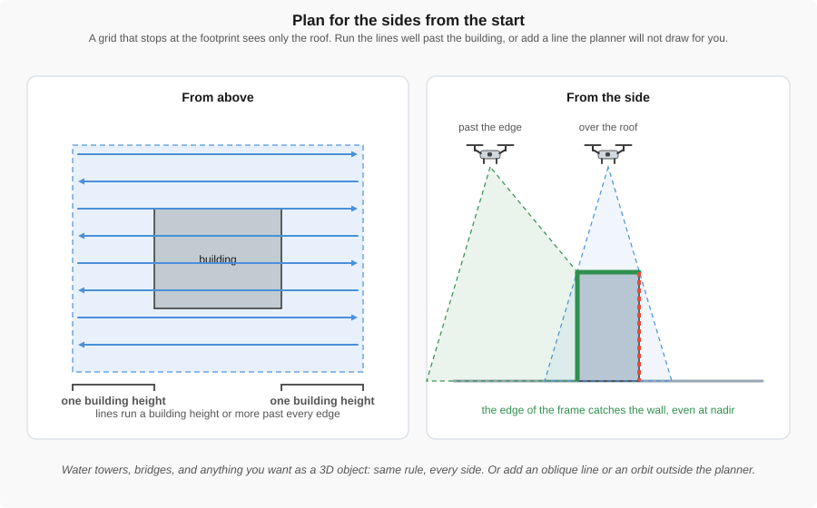

A grid that stops at the footprint sees only the roof. Lines a building height past every edge catch the walls at the edge of the frame.

---

## Plan for the sides from the start

If the goal is a **3D object** — a building, a water tower, a bridge pier — decide how you get its sides *before* you draw the area:

1. **Run the lines well past it.** A line or two beyond the building on every side, at least one building height out. Cheap, and the planner will do it if the area is drawn large enough.
2. **Add a dedicated pass the planner will not draw.** An oblique line along each face, or an orbit, flown after the grid.

A map of the roof is not a model of the building.

---

## Hard constraints first

Thursday's missions each have one line you cannot cross:

- **99 photos** — the DJI Fly limit
- **12 minutes** of mapping time
- **400 ft AGL**, and the **airspace ceiling** near an airport
- A **GSD** the smallest feature demands

Everything else is a goal. Start from the constraint that bites, and plan outward from it.

---

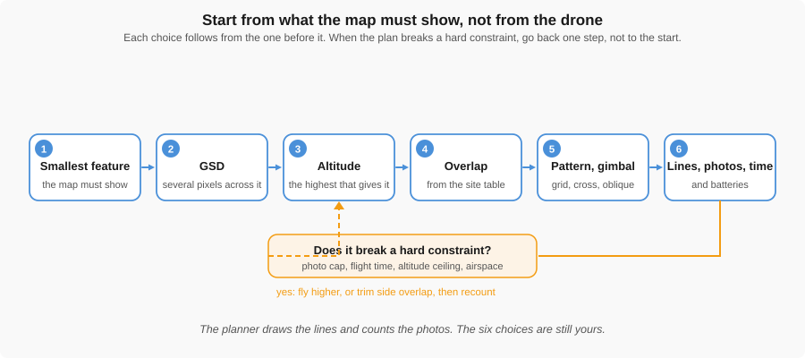

Start from what the map must show and work right. When a hard constraint breaks, go back one step, not to the start.

---

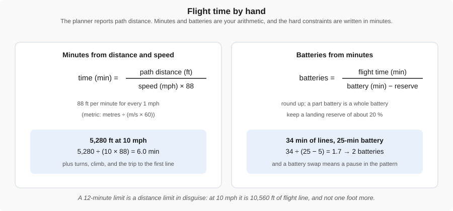

The planner gives you distance. Minutes and batteries are your arithmetic.

---

## Flight time by hand

$$
\text{time (min)} = \frac{\text{path distance (ft)}}{\text{speed (mph)} \times 88}
$$

5,280 ft of flight line at 10 mph:

$$
\frac{5{,}280}{10 \times 88} = 6.0 \text{ min}
$$

Add a minute or two for turns and the climb. A 12-minute limit at 10 mph is **10,560 ft of line, and not one foot more.**

---

## The class flight planner

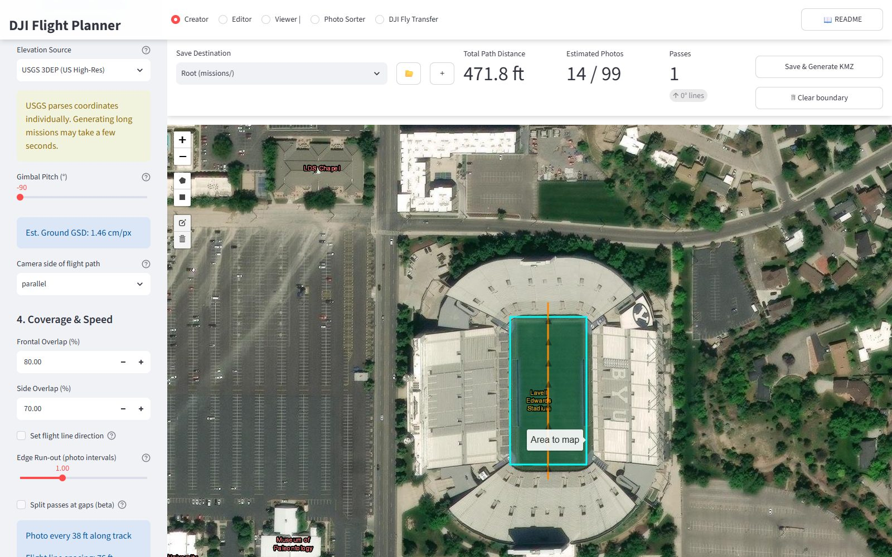

Creator tab: switch to a mapping mission, pick the drone platform, draw the area, set altitude, overlap, speed and gimbal.

---

## The lines it draws

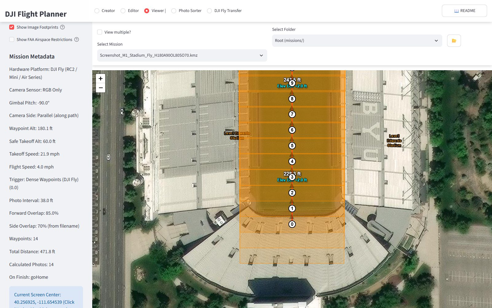

Viewer tab: the grid over the site. Check that the lines run past anything you need the sides of.

---

## What it reports — and what it does not

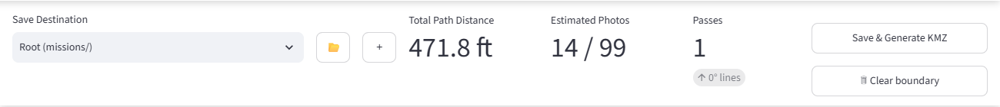

Path distance, photo count against the cap, and passes. GSD is in the sidebar. Flight time is yours to compute from the distance.

---

## The airspace layer

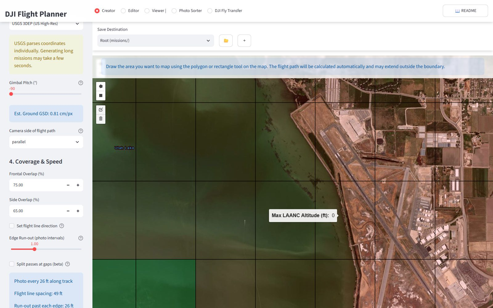

Beside the Provo airport the ceiling reads <strong>0 ft</strong>: no flight there at all. Read the cell you will actually fly in, not the one next to it.

---

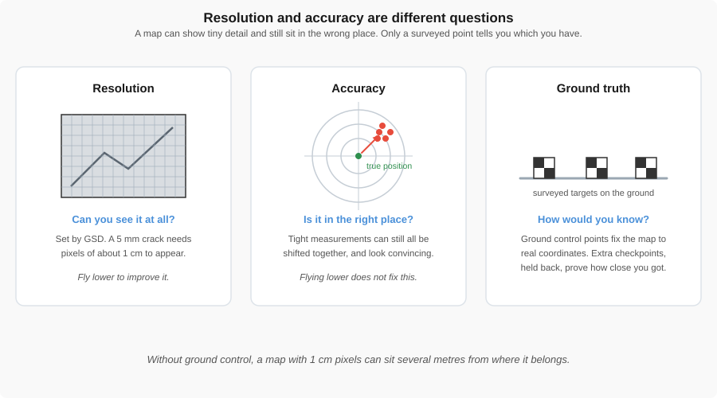

Three different questions. Flying lower answers the first one only.

---

## How you will know it worked

- **Resolution** comes from GSD and answers "can I see it at all"
- **Accuracy** is how close the map sits to the truth. Flying lower does not fix it
- **Ground control points** tie the map to real coordinates. **Checkpoints**, held back, prove how close you got

A 1 cm map can sit several metres from where it belongs and look perfect doing it. Week 7 is where you place the targets.

---

## What to do Thursday

| Mission | The constraint that bites |
|---|---|
| Stadium turf check | 99 photos, GSD ≤ 1.5 cm |
| Inspecting the Y | Steep slope, oblique gimbal, GSD ≤ 2 cm |
| Racing the sunset | 12 minutes, and the airport ceiling |
| Rock Canyon Park (team) | Your drone, your controller, not flat |

Fill in the [Mission Log](../labs/files/lab03_mission_log.xlsx) as you go. Lab page: [Creating Flight Plans](../labs/3_creating_flight_plans.md).
